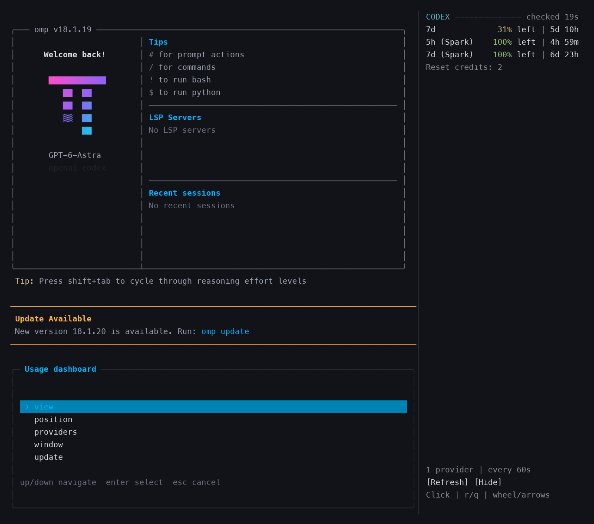

# Oh My Pi Usage Dashboard

Live token charts, persistent session history, and provider allowances in a tmux sidebar for [Oh My Pi (OMP)](https://github.com/can1357/oh-my-pi).

See how quickly your current session is using tokens, what your previous session consumed, and how much account allowance remains—without leaving the terminal. Token usage stays attributed to the provider and model that handled each request, even when you switch models. Session history and dashboard preferences persist across restarts.

[Install](#installation) · [Use](#usage) · [Update](#updating) · [Uninstall](#uninstalling) · [Troubleshoot](#troubleshooting)

[](docs/assets/dashboard.png)

*Compact (left) and Details (right), arranged side by side for comparison. Rendered from actual curses/tmux captures using **mock usage data**, not live account readings. No real conversation content, credentials, or account identifiers are included. Click to enlarge.*

Use `/usage-dashboard view compact` for the overview, or `/usage-dashboard view details` for per-model accounting and sample information.

## What it does

- **Live token-rate chart:** the last 20 minutes of reported usage across all models, with solid bars, a labelled scale, and an idle state.
- **Current and previous sessions:** cumulative token totals and recorded allowance changes survive `/new`, restarts, and resumes. Inherited fork context is not counted as new consumption.
- **Provider and model breakdowns:** Compact mode groups tokens by provider; Details adds per-model input/output and cache-read/write counts. Unattributed task aggregates remain explicitly labelled.
- **Observed quota changes:** separate comparisons for each account and allowance window, in percentage points. Rows appear only when comparable samples exist; these are observations, not exact session billing.
- **Account allowances and balances:** remaining percentages, reset times, and reported API credit balances where supported. Multiple providers can be monitored independently of the current conversation model.
- **A quieter sidebar:** aligned values, section dividers, and spacing; no pending-sample rows or redundant single-provider totals in Compact mode. Detailed explanations stay in Details.
- **Persistent local state:** project-scoped session history plus profile-global totals, and saved provider selection, hidden rows, position, density, polling interval, and visibility.
- **Native managed updates:** release checks and upgrades through OMP's marketplace manager.

### When it is useful

| Use case | How the dashboard helps |
| --- | --- |
| Follow token activity while working | Watch the reported tokens-per-minute chart and the current session total. |
| Compare this session with the last one | Keep the previous session's token totals and available quota comparisons after `/new`. |
| Work across models and providers | Preserve each request's provider/model attribution and inspect input/output/cache breakdowns. |
| Plan work around subscription limits | See remaining allowance and when each reported window resets. |
| Reduce unnecessary information | Use Compact mode, hide providers or account windows, and omit quota comparisons that have no data yet. |
| Monitor prepaid API accounts | Read the provider's reported credit balance alongside other account views. |

**What it is not:** exact subscription billing attribution, a billing forecast, a universal quota API, or a replacement for OMP authentication. Token totals and account percentages are different measurements; percentages are never added across providers or distinct allowance windows. Unsupported account usage is shown as unavailable, and unmeasured session quota changes stay hidden—not presented as an invented zero.

## Requirements

| Component | Requirement |
| --- | --- |
| Operating system | Linux or macOS. Linux is verified; macOS has not been verified here. |
| OMP | Installed on `PATH`, with `omp usage` support. Session accounting verified with OMP 18.1.21; managed updates require native marketplace commands. |
| Python | Python 3.10+ with the standard-library `curses` and `sqlite3` modules. |
| tmux | Version 3.3 or later. |
| Git | Required for marketplace Git sources and source-checkout installation. |
| Terminal application | No specific application required; it must support tmux and curses. |
| Automatic shell integration | Available for bash, zsh, and fish; separate from your choice of terminal application. |
| Terminal width | At least 96 columns to open the 34-column sidebar. |

**Terminal-agnostic; tmux-backed.** Use your preferred terminal application. The dashboard uses tmux and curses rather than a terminal-specific API or plugin. tmux is required, but you do not need to start it manually: the installed shell hook starts a session or attaches the dashboard inside an existing one. OMP's binary and renderer are not patched.

<details>
<summary>Install operating-system prerequisites</summary>

Install OMP using its [official instructions](https://github.com/can1357/oh-my-pi), then install the remaining tools:

```sh
# Arch / CachyOS
sudo pacman -S --needed python tmux git

# Debian / Ubuntu — check that your release provides the required versions
sudo apt install python3 tmux git

# macOS / Homebrew
brew install python tmux git
```

The installer validates Python, curses, OMP, and tmux. It also recognizes an already-installed compatible tmux at `~/.local/share/omp-usage-dashboard/vendor/usr/bin/tmux`. It does not download or bundle tmux.

</details>

## Installation

### Recommended: OMP marketplace

This method supports updates through OMP. It requires a published release: if the [Releases page](https://github.com/MSpiechowicz/oh-my-pi-usage-dashboard/releases) is empty, use the [source-checkout method](#alternative-source-checkout) until the first release is published.

**1. Register the marketplace and install the plugin.** Run these commands in your shell:

```sh
omp plugin marketplace add MSpiechowicz/oh-my-pi-usage-dashboard
omp plugin install oh-my-pi-usage-dashboard@omp-usage-dashboard --scope user
```

**2. Enable automatic sidebar launch with ordinary `omp`.**

```sh
python3 ~/.omp/plugins/node_modules/oh-my-pi-usage-dashboard/install.py --native
```

Use the stable **`node_modules` path**, not a versioned cache directory. Native upgrades change its target, so the shell hook continues to launch the installed version. OMP remains responsible for extension discovery, enablement, and project-over-user precedence; native setup does not create a duplicate agent extension.

**3. Start OMP.**

```sh
omp
```

After installation, open a new terminal tab or window so your shell loads the integration, then run `omp`. Restart any existing OMP processes to load the extension. Log in to your providers through OMP as usual; the dashboard does not have a separate login flow. Shell-specific activation options are listed below.

For other installation layouts, use the matching stable package path:

| Layout | Installer path |
| --- | --- |
| Default user installation | `~/.omp/plugins/node_modules/oh-my-pi-usage-dashboard/install.py` |
| Active XDG data layout | `$XDG_DATA_HOME/omp/plugins/node_modules/oh-my-pi-usage-dashboard/install.py` |
| Project installation | `<project>/.omp/plugins/node_modules/oh-my-pi-usage-dashboard/install.py` |

For project scope, run the native install command with `--scope project` from the project root, then configure its stable installer path with `--native`.

### Alternative: source checkout

Use this for development or before the first marketplace release is available:

```sh
git clone https://github.com/MSpiechowicz/oh-my-pi-usage-dashboard.git
cd oh-my-pi-usage-dashboard
python3 install.py
```

Then run `omp`, using the shell-activation guidance above. **Keep the checkout in place:** the shell hook and extension point to its files. This installation is not managed by native marketplace upgrades; see [Updating a source checkout](#updating-a-source-checkout).

### Migrating a source installation to the marketplace

1. Exit OMP and run `python3 install.py --uninstall` from the original checkout. Repeat with `--agent-dir PATH` for any custom agent directories previously configured.
2. Follow the marketplace installation steps above.
3. Open a new shell to discard the old loaded function, then run `omp`.

Uninstalling the old integration preserves your preferences, credentials, and checkout. Do not delete your OMP agent directory.

<details>
<summary>Shell selection and manual activation</summary>

The installer detects your shell by default. To choose explicitly, add `--shell fish`, `--shell bash`, `--shell zsh`, or `--shell all`. Keep `--native` when configuring a marketplace installation. `--shell none` skips adding a shell hook; it does not remove an existing one.

These options select your **shell**, not your terminal application. Bash and zsh load the hook in a new shell; fish can also autoload it in an already-open shell unless an existing function takes precedence. Opening a new shell is the common activation path.

If needed, activate the hook manually using only the command for your shell:

```sh
# Fish
source ~/.config/fish/functions/omp.fish

# Bash
source ~/.config/omp-usage-dashboard/bash.sh

# Zsh
source ~/.config/omp-usage-dashboard/zsh.sh
```

These paths follow `XDG_CONFIG_HOME` when set. Existing aliases, functions, abbreviations, or unowned destination files can block installation rather than being overwritten. Resolve those conflicts deliberately. Bash login shells must load `.bashrc`; custom startup arrangements may require manual sourcing. Symlinked rc files are not rewritten.

</details>

## Usage

Run `omp` normally, including `omp --resume` or `omp --continue`. Fresh installs start with **no providers selected**, on the right, in compact mode, polling every 60 seconds. The sidebar prompts you to add at least one provider: run `/usage-dashboard providers`, choose **add**, then select a provider you use. Existing saved provider selections are preserved.

Inside OMP, enter:

```text
/usage-dashboard
```

The menu has five sections. Select an action, use **Back** to return to the section list, or **Esc** to cancel. Entering a section directly, such as `/usage-dashboard providers`, opens its submenu.

| Section | Purpose | Example |
| --- | --- | --- |
| **View** | Inspect settings or change display density | `/usage-dashboard view details` |
| **Position** | Move the sidebar left or right | `/usage-dashboard position left` |
| **Providers** | Add, remove, hide, or restore provider views | `/usage-dashboard providers add claude` |
| **Window** | Control the sidebar, polling, and usage-window filters | `/usage-dashboard window interval 60` |
| **Update** | Check for or install a dashboard release | `/usage-dashboard update check` |

### Common tasks

```text
/usage-dashboard providers add claude
/usage-dashboard providers add copilot
/usage-dashboard window hide codex spark
/usage-dashboard view compact
```

**Provider visibility and usage-window filters are separate:**

- `/usage-dashboard providers hide codex` hides the whole Codex view but retains its selection and filters.
- `/usage-dashboard window hide codex spark` hides only Codex rows whose label or ID contains `spark`.
- Replace `hide` with `show` to undo the corresponding action. Showing a usage window does not unhide its provider.
- `/usage-dashboard providers remove codex` removes that view and its saved filters. It does not log you out of OMP.

Window filters are case-insensitive substrings of provider usage-window labels or IDs, **not tmux windows**.

<details>
<summary>Complete command reference</summary>

All commands below are entered inside OMP.

| Command | Effect |
| --- | --- |
| `/usage-dashboard view list` | Show the current configuration. |
| `/usage-dashboard view compact` | Show the token chart, concise session/provider totals, measured quota changes, and dense allowance rows. |
| `/usage-dashboard view details` | Show per-model token/cache breakdowns, quota sample age, source age, and window IDs. |
| `/usage-dashboard position left` | Place the sidebar on the left. |
| `/usage-dashboard position right` | Place the sidebar on the right. |
| `/usage-dashboard providers add ID` | Add a provider view. |
| `/usage-dashboard providers remove ID` | Remove a provider view and its filters. |
| `/usage-dashboard providers hide ID` | Hide a whole provider while retaining its settings. |
| `/usage-dashboard providers show ID` | Show a provider view. |
| `/usage-dashboard window on` | Open the sidebar and remember it as enabled. |
| `/usage-dashboard window off` | Close the sidebar and remember it as disabled. |
| `/usage-dashboard window focus` | Move keyboard focus to the sidebar. |
| `/usage-dashboard window refresh` | Request a fresh usage poll. |
| `/usage-dashboard window interval SECONDS` | Set the polling interval; minimum 15 seconds. |
| `/usage-dashboard window hide ID FILTER` | Hide matching usage-window rows. |
| `/usage-dashboard window show ID FILTER` | Remove a matching usage-window filter. |
| `/usage-dashboard update check` | Check for the latest stable dashboard release. |
| `/usage-dashboard update install` | Upgrade this registered marketplace installation through OMP. |

</details>

### Mouse and keyboard

Click the sidebar to focus it; click the OMP pane to return to your prompt. In the sidebar:

| Control | Action |
| --- | --- |
| **Refresh** button or **r** | Request fresh usage data. |
| **Hide** button or **q** | Close the sidebar and save the off state. |
| Mouse wheel or **Up/Down** | Scroll session history, model breakdowns, and provider views. |

With default tmux bindings, **Ctrl-b**, then **o**, switches panes. Your terminal may allow **Shift**-selection to bypass tmux mouse handling.

### Reading the numbers

Percentages in the account-allowance section mean **remaining allowance**: green above 40%, amber above 20% through 40%, and red at 20% or below. Labels and reset times remain neutral. Credit balances stay in their reported currency rather than becoming an estimated percentage.

`checked Ns` describes the dashboard's last completed poll, not the age of the provider's data. Old source data is marked as cached; failed refreshes retain the last successful report with **STALE DATA**. Details mode shows source age and window IDs. The dashboard invalidates the selected provider's OMP usage cache before polling, but cannot force an upstream counter to change. Hidden providers are not polled. Keep the default 60-second interval unless you have a reason to change it; shorter intervals can encounter rate limits.

### Live chart and session history

The **Token rate** chart uses 20 one-minute buckets across all models, including the current, incomplete minute. Solid bars use fractional terminal cells, with a labelled vertical scale and time axis; ASCII-only terminals get a fallback. The vertical scale adjusts to the displayed peak, and an empty minute has no bar. With no recent usage, a single idle line replaces the empty chart. Token records update on completed usage events, with a one-second check for auxiliary model usage. This is reported request usage, not a token-by-token stream or the current context-window size.

**Current session** and **Previous session** show cumulative reported token totals. Compact mode groups them by provider; `/usage-dashboard view details` also shows the actual model on each request, input/output tokens, and cache reads/writes. Switching models never reassigns earlier usage to the newly selected model. Cached tokens remain part of the provider's reported total, not an extra amount added on top of it.

Section dividers and blank lines separate token rate, session summaries, history, and account allowances. Compact mode avoids repeating the total for a single provider, hides history when the project has no recorded usage, and omits a nonexistent previous session. Details mode retains per-model breakdowns and session IDs.

**Recorded history** is split into two views. **Previous sessions** is the total of locally recorded requests from sessions other than the current one in the current Git repository (or current working directory when no repository root is found). **Total tokens** is the aggregate of all recorded requests in the current project, including the current session. `/new` preserves both summaries. Resuming the same conversation continues its record, while inherited fork context is excluded from new consumption. The previous summary is the pane's preceding conversation, falling back to the most recently recorded other conversation in this project; it is not necessarily a completed session if another OMP is still using it. Large token totals use compact `k`, `M`, `B`, and `T` units.

OMP's main-session assistant messages and auxiliary `model_usage` records retain their provider/model attribution. Aggregated task usage without a route breakdown is shown separately as **task (mixed)** / **mixed / unattributed**, rather than being charged to the main model. Noninteractive child extensions do not independently record those same task requests.

### Session quota changes are observations, not exact billing

Each supported account/window gets its own **observed quota change**, expressed in **percentage points (pp)**. For example, an allowance moving from 20% used to 24.2% used contributes **+4.20 pp**. Hourly, five-hour, weekly, monthly, or other labels come from the provider; the dashboard does not invent an hourly or total quota if none is reported.

- Token totals can be combined across models; quota percentages cannot be combined across providers, accounts, or distinct allowance windows. Shared model buckets are observed once, not multiplied by the number of models used.
- Different accounts/buckets remain separate. Short bracketed bucket fingerprints distinguish otherwise identical labels without displaying raw account IDs.
- A fresh baseline and a comparable second sample are required. Quota rows and their heading stay hidden until the accumulated change rounds to a positive value at two decimal places; there are no “awaiting samples” or “+0.00 pp” rows. Unchanged samples and smaller increases remain recorded, so small increases can accumulate into a visible change. Old cached samples, late responses from a previous session, and duplicate timestamps do not establish new consumption.
- A changed reset/limit, decreasing counter, or resumed session starts a separate observation segment. The summary adds only observed increases inside those segments; it never subtracts across a reset or charges the inactive resume gap. Segment counts, sample ages, and explanatory notes appear only in Details mode.
- Provider counters can lag and include other sessions, applications, or machines. Changes before the first sample or after the last sample cannot be attributed. These values are **not exact per-session or per-model subscription charges**, and tokens are not converted into quota percentages or dollar charges.
- Account sampling runs at the configured polling interval while the sidebar and provider view are visible. Hidden providers are not polled. A provider without a stable account scope or percentage cannot produce a session quota comparison; its quota summary stays hidden rather than implying zero. Historical summaries remain visible regardless of the current account-view filters.

Restart OMP after updating the extension to enable collection. Token recording continues when the sidebar is hidden; account-quota sampling does not.

## Provider availability

Authentication stays in OMP. Usage availability depends on the provider endpoint, account plan, and credential type.

| Input | OMP provider ID | What can be displayed |
| --- | --- | --- |
| `codex` | `openai-codex` | Reported allowance windows and reset times. Verified with live credentials. |
| `claude` | `anthropic` | Usage windows when the account and credentials support them. |
| `copilot` | `github-copilot` | Reported usage and allowances when available. |
| `gemini` | `google-gemini-cli` | Usage exposed by OMP's Gemini CLI adapter. |
| `deepseek` | `deepseek` | Reported API credit balance; official balance endpoint fallback. Not a subscription quota. |
| `grok` | `xai` | Usage only when OMP supplies a compatible report. |
| `xai-oauth` | `xai-oauth` | Separate SuperGrok OAuth adapter; select it explicitly. |

Other provider IDs are accepted when OMP can supply a compatible report. Live credential-dependent behavior for providers other than Codex has not been verified here. Ordinary xAI API credentials do not imply access to SuperGrok quotas or management billing.

## Settings and privacy

Provider order, hidden providers, window filters, position, display mode, polling interval, and on/off state are saved per profile:

| Configuration | Preferences file |
| --- | --- |
| Default | `~/.omp/agent/usage-dashboard.json` |
| Custom default agent directory | `$PI_CODING_AGENT_DIR/usage-dashboard.json` |
| Named profile | `~/.omp/profiles/NAME/agent/usage-dashboard.json` |

Use `omp --profile NAME` to select a profile. Keep a custom `PI_CODING_AGENT_DIR` in your launching environment. Source-checkout installations must also register the extension in each custom agent directory using `python3 install.py --agent-dir PATH`.

Changes affect the current dashboard and subsequent launches, not other already-running panes. Preferences use locked, atomic updates; malformed settings produce an error rather than being silently reset. Release-check metadata is stored separately in `usage-dashboard-update.json` beside the preferences file.

Session accounting is stored in **`usage-dashboard.sqlite3`** beside the preferences file, separately for each profile and project scope. It is created with owner-only permissions and updated transactionally as usage arrives, not just at shutdown. It stores hashed project scopes, session/request identifiers, timestamps, provider/model names, numeric token counters, and quota observation summaries with hashed account/window identities. It does not copy prompts, responses, tool output, credentials, raw account IDs, or raw project paths. A crash can lose usage not yet reported or saved, but does not erase already committed session history. Uninstalling the integration leaves this history intact.

**Do not paste API keys or tokens into dashboard commands.** The dashboard uses OMP authentication, does not store credentials in its preference files, and does not render account emails or account/credential IDs. DeepSeek's fallback obtains its credential from OMP and uses it in the provider-fetch process. Release checks contact the public GitHub API without provider credentials.

## Updating

### Marketplace installations

Inside OMP:

```text
/usage-dashboard update check
/usage-dashboard update install
```

**Restart OMP after installation** to load the updated extension and sidebar. Your saved preferences and credentials are retained.

Every interactive OMP startup requests a fresh release check in the background, so a previously cached “up to date” result does not hide a newly published version. For marketplace installations, a newer version produces a visible notice with `/usage-dashboard update install`. Checks do not block the prompt or automatically install code. Startup network failures remain quiet; explicit `update check` commands also request fresh release data and report errors.

Source-checkout installations do not offer native marketplace upgrades. Their explicit update check reports the manual `git pull --ff-only` and `python3 install.py` path instead; use the marketplace installation if you want updates managed through OMP.

Installation uses OMP's **native marketplace manager** and preserves the current user/project scope. It refuses unregistered checkouts or mismatched installations instead of overwriting them. OMP's native notification mode currently logs update availability; this extension supplies the visible notice.

You can also use OMP's built-in commands directly:

```text
/marketplace update omp-usage-dashboard
/marketplace upgrade oh-my-pi-usage-dashboard@omp-usage-dashboard --scope user
```

Or, from your shell:

```sh
omp plugin marketplace update omp-usage-dashboard
omp plugin upgrade oh-my-pi-usage-dashboard@omp-usage-dashboard --scope user
```

Use `--scope project` for a project-scoped installation. **`omp update` updates OMP itself, not this dashboard.**

### Updating a source checkout

Exit OMP, review any local changes, then run from the checkout:

```sh
git pull --ff-only
python3 install.py
```

Restart OMP afterward. If Git reports a conflict or divergent history, resolve it without discarding your work. Use the marketplace installation if you want dashboard updates managed through OMP.

## Uninstalling

Exit OMP sessions using the dashboard before removing its integration.

### Marketplace installation

Remove the shell hook **before** uninstalling the plugin, while its installer still exists:

```sh
python3 ~/.omp/plugins/node_modules/oh-my-pi-usage-dashboard/install.py --native --uninstall
omp plugin uninstall oh-my-pi-usage-dashboard@omp-usage-dashboard --scope user
```

Use the corresponding XDG or project package path, and `--scope project` where applicable. If you no longer use this marketplace, you can also remove its catalog registration:

```sh
omp plugin marketplace remove omp-usage-dashboard
```

### Source-checkout installation

From the original checkout:

```sh
python3 install.py --uninstall
```

Repeat with the original `--agent-dir PATH` for custom agent directories. Use the original `--bin-dir` if you previously installed a legacy launcher link elsewhere.

**Open a new shell afterward** to discard the loaded `omp` function. Uninstallation removes only this installation's owned integration. It preserves your dashboard preferences, provider credentials, OMP binary, and separately installed tmux. Source-checkout removal also preserves the checkout; delete it separately only after checking for your own changes. Do not delete your OMP agent directory or profiles to remove the dashboard.

## Troubleshooting

| Symptom | What to check |
| --- | --- |
| `omp` starts without a sidebar | Widen the terminal to at least 96 columns, then try `/usage-dashboard window on`. Confirm the correct shell hook is loaded and restart an OMP process opened before installation. |
| The shell still runs a custom `omp` command | An existing function or alias can take precedence over the installed hook. Inspect `type omp`; do not overwrite your customization blindly. |
| Usage is unavailable | Confirm the provider login in OMP and try `omp usage --provider openai-codex` in your shell, substituting the appropriate provider ID. Chat access alone does not guarantee a usage API. |
| Values look old | Inspect `view details`, then request `window refresh`. The provider may still return cached data. |
| Update says the installation is unmanaged | Use the source-checkout update instructions or migrate to marketplace installation. |
| Marketplace installation cannot find a release tag | Check the Releases page and wait for a successful release workflow, or use the source-checkout method. |
| Mouse selection behaves differently | tmux owns mouse input inside the session; try your terminal's selection override, often Shift. Inline graphics also depend on terminal/tmux support. |

For a temporary shell-launcher bypass, use `command omp`. Noninteractive invocations, help/version requests, and CLI subcommands pass through without opening a dashboard session. Inside an existing tmux session, a bypassed OMP can still load the extension; `window off` disables its sidebar.

## Development and releases

Run the local checks from the repository:

```sh
python3 -m unittest discover -v
node --check extension.js
```

Tests use isolated fixtures, not live account credentials. Interactive verification has covered fish/tmux launch, mouse controls, nested menus, preference persistence, native upgrades, and project-over-user discovery. Live provider verification is limited to Codex; passing offline tests does not establish support for another account or provider.

Session accounting has also been exercised with the installed OMP runtime using isolated saved sessions: multiple models/providers, `/new`, and previous-session persistence. Curses rendering and scrolling were checked in a 34-column tmux pane. Quota-reset/account-attribution checks use offline fixtures; they do not establish live quota reporting support for additional providers.

GitHub Actions validates pull requests and `main` pushes. A successful main push bumps the patch version, synchronizes the marketplace version and pinned tag, atomically pushes the metadata commit and tag, and publishes a GitHub Release. Manual dispatch supports patch, minor, and major bumps. No npm publishing token is required.

Repository policy must allow the release job's `GITHUB_TOKEN` to write commits and tags. Protected branch/tag rules can block publication. Stale revisions are skipped; token-authored pushes do not recursively release. If publication fails after the Git push, rerun the failed workflow in a fresh checkout while `main` still points to that release commit. If `main` has advanced, publish the existing tag manually or let the next release proceed. See [the workflow](.github/workflows/release.yml) and [release helper](release.py).

## References and license

[OMP marketplace documentation](https://github.com/can1357/oh-my-pi/blob/main/docs/marketplace.md) · [OMP usage adapters](https://github.com/can1357/oh-my-pi/tree/main/packages/ai/src/usage) · [DeepSeek balance API](https://api-docs.deepseek.com/api/get-user-balance) · [xAI management API](https://docs.x.ai/developers/management-api-guide)

See [LICENSE](LICENSE).
