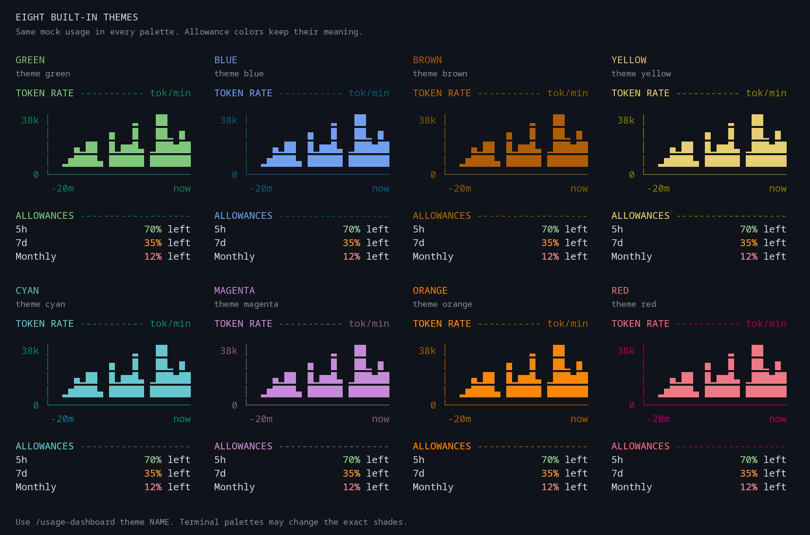

# Harness Usage Dashboard

Live token charts and persistent session history in a tmux sidebar for [Oh My Pi (OMP)](https://github.com/can1357/oh-my-pi) and, through a separate opt-in shell hook, Claude Code.

For OMP, see how quickly your current session is using tokens, what your previous session consumed, and how much account allowance remains—without leaving the terminal. Token usage stays attributed to the provider and model that handled each request, even when you switch models. Session history and dashboard preferences persist across restarts. The standalone Claude Code path records locally reported API-request tokens and, when available, displays its status-line rate limits; it does not use OMP's provider accounting or provide account-specific quota-change history.

**Your recorded usage history stays on your machine.** Session token records and OMP's observed quota changes are saved in local SQLite databases, not a hosted dashboard service. OMP and Claude Code use physically separate data directories and JSON settings. See [Settings and privacy](#settings-and-privacy) for file locations and exactly what is stored.

[Install](#installation) · [Use](#usage) · [Themes](#theme-preview) · [Update](#updating) · [Uninstall](#uninstalling) · [Troubleshoot](#troubleshooting)

Inside either host, use `/usage-dashboard view compact` for the overview or `/usage-dashboard view details` for per-model token accounting. OMP's command and Claude's personal skill are separate integrations; only OMP records observed account-specific session quota changes.

## What it does

- **Live token-rate chart:** the last 20 minutes of reported usage across all models, with solid bars, a labelled scale, and an idle state.
- **Current and previous sessions:** cumulative token totals persist across restarts. OMP also records allowance comparisons; Claude Code does not provide account-specific quota-change history.
- **Provider and model breakdowns:** OMP Compact mode groups tokens by provider; Details separates each model by effective thinking level and includes input/output and cache-read/write counts. Unattributed task aggregates remain explicitly labelled. Claude Code records available per-request token counts from local telemetry separately.
- **Observed quota changes (OMP only):** Compact shows separate comparisons for each account and allowance window, in percentage points. Rows appear only when comparable samples exist; these are observations, not exact session billing.
- **Account allowances and balances:** OMP displays remaining percentages, reset times, and reported API credit balances where supported. Claude Code can show five-hour and seven-day limits only when its status-line payload includes them.
- **A quieter sidebar:** aligned values, section dividers, and spacing; no pending-sample rows or redundant single-provider totals in Compact mode.
- **Local storage:** recorded usage lives in host-separated SQLite databases. OMP records are scoped by project within each OMP profile; Claude Code records are scoped by project in Claude's own storage. Preferences persist in separate local JSON files.
- **Design-token theming:** choose from nine named palettes: green, blue, brown, yellow, cyan, magenta, orange, red, and the opt-in Claude palette inspired by Anthropic's brand colors. Rules, chart bars, and body text follow each palette's tokens; healthy, warning, and critical values stay green, orange, and red for clear allowance semantics.
- **Host-specific updates:** OMP uses its native marketplace manager; Claude's personal skill can check a source-checkout release and install it only when the original checkout is eligible for a safe Git fast-forward.

### When it is useful

| Use case | How the dashboard helps |
| --- | --- |
| Follow token activity while working | Watch the reported tokens-per-minute chart and current session total in either host. |
| Compare this session with the last one | Keep the previous session's token totals; OMP also preserves available quota comparisons after `/new`. |
| Work across models and providers in OMP | Preserve each request's provider/model attribution and inspect input/output/cache breakdowns. |
| Plan work around subscription limits | See remaining allowance and reported reset times when supported; Claude Code status-line limits may be unavailable. |
| Reduce unnecessary information in OMP | Use Compact mode, hide providers or account windows, and omit quota comparisons that have no data yet. |
| Monitor prepaid API accounts in OMP | Read the provider's reported credit balance alongside other account views. |

**What it is not:** exact subscription billing attribution, a billing forecast, a universal quota API, or a replacement for host authentication. OMP's `claude`/`anthropic` provider view is **not** standalone Claude Code session accounting: OMP-provider token counts do not equal Claude Code session counts. Token totals and account percentages are different measurements; percentages are never added across providers or distinct allowance windows. Unsupported or missing account usage is shown as unavailable, and unmeasured changes stay hidden—not presented as an invented zero.

## Requirements

| Component | Requirement |
| --- | --- |
| Operating system | Linux or macOS. Linux is verified for OMP; macOS and live Claude Code usage have not been verified here. |
| OMP path | OMP installed on `PATH`, with `omp usage` support. Session accounting verified with OMP 18.1.21; managed updates require native marketplace commands. Not required for Claude Code. |
| Claude Code path | Claude CLI installed on `PATH`; independent of OMP. |
| Python | Python 3.10+ with the standard-library `curses` and `sqlite3` modules. |
| tmux | Version 3.3 or later. |
| Git | Required for OMP marketplace Git sources and source-checkout installation; use it to obtain/update the Claude Code checkout. |
| Terminal application | No specific application required; it must support tmux and curses. |
| Automatic shell integration | Separate bash, zsh, and fish hooks for OMP and Claude Code; use ordinary `omp` or `claude` after activating the corresponding hook. |
| Terminal width | At least 96 columns to open the 34-column sidebar. |

**Terminal-agnostic; tmux-backed.** Use your preferred terminal application. The dashboard uses tmux and curses rather than a terminal-specific API or plugin. tmux is required, but you do not need to start it manually: each host's installed shell hook starts a session or attaches the dashboard inside an existing one. Neither host's binary and renderer are patched. Dashboard sessions disable tmux terminal-graphics passthrough because it is terminal-global rather than pane-local; this prevents image previews from covering the editor pane.

<details>
<summary>Install operating-system prerequisites</summary>

For the OMP path, install OMP using its [official instructions](https://github.com/can1357/oh-my-pi). For the separate Claude Code path, install the Claude CLI using its official instructions. Then install the remaining tools:

```sh
# Arch / CachyOS
sudo pacman -S --needed python tmux git

# Debian / Ubuntu — check that your release provides the required versions
sudo apt install python3 tmux git

# macOS / Homebrew
brew install python tmux git
```

The OMP installer validates Python, curses, OMP, and tmux; the Claude Code installer validates Python, curses, Claude CLI, and tmux. Both recognize an already-installed compatible tmux at `~/.local/share/omp-usage-dashboard/vendor/usr/bin/tmux`. Neither downloads or bundles tmux.

</details>

## Installation
Choose **one or both** independent host integrations. OMP installation uses its native marketplace; Claude Code installs a shell hook and a personal skill from a source checkout, without requiring OMP.

### Recommended for OMP: marketplace

Marketplace installation requires a published [catalog](https://github.com/MSpiechowicz/harness-usage-dashboard/blob/main/.omp-plugin/marketplace.json) and its referenced [release tag](https://github.com/MSpiechowicz/harness-usage-dashboard/releases) containing the renamed plugin. Until both are available, use the [source-checkout method](#alternative-source-checkout). If a previous extension is installed, [remove it first](#remove-the-previous-extension).

**1. Register the marketplace and install the plugin.** Run these commands in your shell:

```sh
omp plugin marketplace add MSpiechowicz/harness-usage-dashboard
omp plugin install harness-usage-dashboard@harness-usage-dashboard --scope user
```

**2. Enable automatic sidebar launch with ordinary `omp`.**

```sh
python3 ~/.omp/plugins/node_modules/harness-usage-dashboard/install.py --native
```

Use the stable **`node_modules` path**, not a versioned cache directory. Native upgrades change its target, so the shell hook continues to launch the installed version. OMP remains responsible for extension discovery, enablement, and project-over-user precedence; native setup does not create a duplicate agent extension.

OMP-specific shell-hook and local-data paths retain their existing names so removal and reinstallation preserve recorded usage and preferences; they are not the marketplace or plugin ID.

**3. Start OMP.**

```sh
omp
```

After installation, open a new terminal tab or window so your shell loads the integration, then run `omp`. Restart any existing OMP processes to load the extension. Log in to your providers through OMP as usual; the dashboard does not have a separate login flow. Shell-specific activation options are listed below.

For other installation layouts, use the matching stable package path:

| Layout | Installer path |
| --- | --- |
| Default user installation | `~/.omp/plugins/node_modules/harness-usage-dashboard/install.py` |
| Active XDG data layout | `$XDG_DATA_HOME/omp/plugins/node_modules/harness-usage-dashboard/install.py` |
| Project installation | `<project>/.omp/plugins/node_modules/harness-usage-dashboard/install.py` |

For project scope, run `omp plugin install harness-usage-dashboard@harness-usage-dashboard --scope project` from the project root, then configure its stable installer path with `--native`.

### Alternative: source checkout

Use this for development or until the catalog and release described above are published:

```sh
git clone https://github.com/MSpiechowicz/harness-usage-dashboard.git
cd harness-usage-dashboard
python3 install.py
```

Then run `omp`, using the shell-activation guidance above. **Keep the checkout in place:** the shell hook and extension point to its files. This installation is not managed by native marketplace upgrades; see [Updating a source checkout](#updating-a-source-checkout).

### Claude Code: independent source-checkout integration

Install the Claude CLI first. Clone this repository if needed (or use your existing source checkout), then run:

```sh
git clone https://github.com/MSpiechowicz/harness-usage-dashboard.git
cd harness-usage-dashboard
python3 claude_install.py
```

Keep the checkout in place: the shell hook and Claude's personal `/usage-dashboard` skill refer to its files. The skill is installed under `${CLAUDE_CONFIG_DIR:-~/.claude}/skills/usage-dashboard/`. Open a new shell to activate the bash or zsh hook (fish autoloads its function), then start an interactive session:

```sh
claude
claude --continue
```

The hook launches interactive Claude Code beside the sidebar. Help, subcommands, and noninteractive invocations pass straight through to the Claude CLI. Use `command claude` to bypass the hook temporarily. `python3 claude_install.py --shell none` installs only the personal skill on a fresh setup; on an existing owned installation it removes that installation's owned hooks. It does not remove other owners' files or an already-loaded shell function. Claude's skill controls only the Anthropic-backed Claude dashboard, not OMP or other providers. This is not a native Claude marketplace installation.

The installer respects `CLAUDE_CONFIG_DIR` for Claude's personal skill and dashboard data. Use the same environment when launching Claude and when uninstalling. Existing shell customizations and unrelated files at managed destinations are not overwritten: resolve a collision explicitly rather than deleting or replacing another owner's files. An exact legacy wrapper from this checkout can be migrated; if it was installed in a custom location, provide its original `--bin-dir PATH`. See [Claude Code usage](#claude-code-usage) for skill commands and capture limits.

To choose a shell explicitly, use `python3 claude_install.py --shell bash`, `--shell zsh`, `--shell fish`, or `--shell all`; the default detects your shell. For manual activation, source `~/.config/claude-usage-dashboard/bash.sh` in bash, `~/.config/claude-usage-dashboard/zsh.sh` in zsh, or `~/.config/fish/functions/claude.fish` in fish (replace `~/.config` with `$XDG_CONFIG_HOME` when set). These are Claude-specific paths; OMP's hook remains separate.

### Migrating a source installation to the marketplace

1. Exit OMP and run `python3 install.py --uninstall` from the original checkout. Repeat with `--agent-dir PATH` for any custom agent directories previously configured.
2. Follow the marketplace installation steps above.
3. Open a new shell to discard the old loaded function, then run `omp`.

Uninstalling the source integration preserves your preferences, credentials, and checkout. Do not delete your OMP agent directory.

### Remove the previous extension

Exit OMP sessions using `oh-my-pi-usage-dashboard`. For a user-scope marketplace installation, remove its shell hook **before** uninstalling the old plugin:

```sh
python3 ~/.omp/plugins/node_modules/oh-my-pi-usage-dashboard/install.py --native --uninstall &&
omp plugin uninstall oh-my-pi-usage-dashboard@omp-usage-dashboard --scope user
```

For a project-scope installation, run from the project root, use `<project>/.omp/plugins/node_modules/oh-my-pi-usage-dashboard/install.py` and `--scope project`. With an XDG data layout, use `"$XDG_DATA_HOME/omp/plugins/node_modules/oh-my-pi-usage-dashboard/install.py"`. Remove the old registration with `omp plugin marketplace remove omp-usage-dashboard` only when no other installations need it; coordinate their removal first if the registration is shared.

If the old extension was installed from a source checkout instead, run `python3 install.py --uninstall` from that original checkout (and repeat with the original `--agent-dir PATH` for any custom agent directories). Do not delete the OMP agent directory: uninstall preserves preferences, recorded usage, and credentials. Open a new shell to discard the old loaded hook, then follow [Installation](#installation) for `harness-usage-dashboard`.

<details>
<summary>Shell selection and manual activation</summary>

The installer detects your shell by default. To choose explicitly, add `--shell fish`, `--shell bash`, `--shell zsh`, or `--shell all`. Keep `--native` when configuring a marketplace installation. `--shell none` skips adding a shell hook; it does not remove an existing one.

These options select your **shell**, not your terminal application. Bash and zsh load the hook in a new shell; fish can also autoload it in an already-open shell unless an existing function takes precedence. Opening a new shell is the common activation path.

If needed, activate the hook manually using only the command for your shell:

```sh
# Fish
source ~/.config/fish/functions/omp.fish

# Bash
source ~/.config/omp-usage-dashboard/bash.sh

# Zsh
source ~/.config/omp-usage-dashboard/zsh.sh
```

These paths follow `XDG_CONFIG_HOME` when set. Existing aliases, functions, abbreviations, or unowned destination files can block installation rather than being overwritten. Resolve those conflicts deliberately. Bash login shells must load `.bashrc`; custom startup arrangements may require manual sourcing. Symlinked rc files are not rewritten.

</details>

## Usage

### Claude Code usage

Run `claude` or `claude --continue` in a shell with the installed hook to start interactive Claude Code alongside the tmux sidebar. The hook forwards ordinary Claude arguments; help, subcommands, and noninteractive invocations pass through. For a temporary hook bypass, use `command claude`. This mode does not install an OMP extension. Inside Claude Code, use the separately installed **personal skill** `/usage-dashboard`; this is model-mediated skill guidance, not OMP's native command or menu. Enter `/usage-dashboard` with no arguments to see help and the current configuration, not an interactive section menu. For example:

```text
/usage-dashboard previous hide
/usage-dashboard previous show
/usage-dashboard view compact
/usage-dashboard view details
/usage-dashboard theme blue
/usage-dashboard position left
/usage-dashboard window off
/usage-dashboard window on
/usage-dashboard update check
/usage-dashboard update install
```

Visibility settings change presentation, not recorded tokens; `previous show` restores the section when data is available. The skill may invoke local tools to change preferences, control the sidebar, or check/install an update. Claude Code's tool-permission prompts and your own authorization still apply: installing the skill does **not** auto-approve commands. Claude's dashboard has only the Anthropic provider: you can add, remove, hide, or show that one view, but OMP's multi-provider management and OMP account comparisons are unavailable here.

Claude Code request totals come from its locally emitted OTLP `api_request` log events, tied to Claude session lifecycle hooks. The launcher creates owner-only temporary settings **for that run** rather than rewriting Claude's global settings. Only complete reported requests can count; no requests are inferred from transcripts or a provider's account allowance. Capture may be incomplete or unavailable when Claude is not emitting compatible events, when its telemetry destination conflicts, or before a completed request arrives. **Missing capture means unknown usage, not zero tokens.** The sidebar displays a token-capture warning even when separate allowance windows are available. Existing Claude telemetry and status-line destinations are not overwritten; a conflicting configuration can prevent this integration from receiving the affected data.

When Claude supplies `rate_limits` in a compatible status-line payload, the sidebar can display five-hour and seven-day allowance windows. These fields may be absent on unsupported plans or early in a session, and an existing status-line command may prevent capture. The dashboard does **not** know a stable Claude account identity, so it does not record or display account-specific session quota-change history. Its OMP `claude` provider view and OMP quota observations are separate and cannot be used as Claude Code session totals.

#### Direct shell controls for Claude's dashboard

From a regular shell in this repository's checkout root, run `python3 dashboard.py control --host claude --` followed by one command shown below. These are **alternatives**, not a script to run from top to bottom: copy only the line for the change you want. They configure the local Claude dashboard without a Claude subscription or a Claude Code tool-permission prompt. They do not bypass Claude Code authentication: using Claude models and receiving request or allowance data still depend on Claude Code and the available telemetry. Keep `CLAUDE_CONFIG_DIR` the same as for your Claude installation/session so the commands read and save the same preferences.

Inspect the saved configuration or choose a display mode:

```sh
python3 dashboard.py control --host claude -- view list
python3 dashboard.py control --host claude -- view compact
python3 dashboard.py control --host claude -- view details
```

Hide or restore individual sections. These switches do not delete recorded usage. History Other and History Total can show available token history, but Claude has no account-specific quota-change history to display.

```sh
python3 dashboard.py control --host claude -- commands hide
python3 dashboard.py control --host claude -- commands show
python3 dashboard.py control --host claude -- previous hide
python3 dashboard.py control --host claude -- previous show
python3 dashboard.py control --host claude -- history-other hide
python3 dashboard.py control --host claude -- history-other show
python3 dashboard.py control --host claude -- history-total hide
python3 dashboard.py control --host claude -- history-total show
```

Choose the sidebar side or one of the nine named palettes, including the opt-in Claude palette:

```sh
python3 dashboard.py control --host claude -- position left
python3 dashboard.py control --host claude -- position right
python3 dashboard.py control --host claude -- theme green
python3 dashboard.py control --host claude -- theme blue
python3 dashboard.py control --host claude -- theme brown
python3 dashboard.py control --host claude -- theme yellow
python3 dashboard.py control --host claude -- theme cyan
python3 dashboard.py control --host claude -- theme magenta
python3 dashboard.py control --host claude -- theme orange
python3 dashboard.py control --host claude -- theme red
python3 dashboard.py control --host claude -- theme claude
```

Override the heading accent or chart color with a quoted hex color. Choosing another named theme keeps custom overrides; `theme reset` returns to green **and clears all overrides**.

```sh
python3 dashboard.py control --host claude -- theme custom accent '#58a66a'
python3 dashboard.py control --host claude -- theme custom chart '#58a66a'
python3 dashboard.py control --host claude -- theme reset
```

Enable/disable the sidebar or set its poll interval (60 seconds here; minimum 15 seconds). `window focus` selects the targeted sidebar pane, and `window refresh` requests a fresh poll. Use either only when deliberately targeting the actual owning Claude pane: when the sidebar is enabled, either command can create one if the targeted pane has none.

```sh
python3 dashboard.py control --host claude -- window on
python3 dashboard.py control --host claude -- window off
python3 dashboard.py control --host claude -- window focus
python3 dashboard.py control --host claude -- window refresh
python3 dashboard.py control --host claude -- window interval 60
```

Claude supports only `anthropic`. `providers hide` requires that view to be selected; `providers show` adds it back if needed. `providers remove` also removes its window filters, while hiding retains its settings. Use these as alternatives, not in sequence:

```sh
python3 dashboard.py control --host claude -- providers add anthropic
python3 dashboard.py control --host claude -- providers remove anthropic
python3 dashboard.py control --host claude -- providers hide anthropic
python3 dashboard.py control --host claude -- providers show anthropic
```

With `anthropic` selected, hide or restore each reported allowance row independently. Filters match the window IDs; they do not remove token totals or manufacture unavailable rate-limit data.

```sh
python3 dashboard.py control --host claude -- window hide anthropic 'claude:five_hour'
python3 dashboard.py control --host claude -- window show anthropic 'claude:five_hour'
python3 dashboard.py control --host claude -- window hide anthropic 'claude:seven_day'
python3 dashboard.py control --host claude -- window show anthropic 'claude:seven_day'
```

For preference-only changes, run these commands outside tmux with `TMUX_PANE` unset; `window on` there saves the preference without immediately opening a sidebar. Inside **any** tmux pane, the shell inherits `TMUX_PANE` and the CLI uses that pane as the owner unless you pass `--owner` **before** `--`. The CLI checks the pane ID format, not whether that pane belongs to Claude: an enabled configuration can cause these commands, including `window focus` or `window refresh`, to select or create a sidebar in an unrelated tmux pane. To change an already-running sidebar, run the command from its actual owning Claude pane's shell context, or pass that pane's actual tmux ID with `--owner` **before** `--`; do not target an unrelated pane. Saved changes do not update other already-running Claude panes; restart those sessions to pick up the preferences. Without an owner pane, `window focus` and `window refresh` cannot affect a running sidebar.

### OMP usage

Run `omp` normally, including `omp --resume` or `omp --continue`. Fresh installs start with **no providers selected**, on the right, in compact mode, polling every 60 seconds. The sidebar prompts you to add at least one provider: run `/usage-dashboard providers`, choose **add**, then select a provider you use. Existing saved provider selections are preserved.

### OMP commands and settings

The following slash commands and provider-management guidance apply **only inside OMP**. Claude Code's separate `/usage-dashboard` personal skill is not OMP's native command or menu; shared rendering descriptions below do not make OMP's per-provider measurements into Claude session accounting.

Inside OMP, enter:

```text
/usage-dashboard
```
The menu has seven sections. Use the **Left Arrow** to return to the section list, or **Esc** to cancel. Entering a section directly, such as `/usage-dashboard providers`, opens its submenu.

Dashboard command results, help, warnings, and errors use a bold **Usage Dashboard** heading and readable body text in the active OMP theme. Warning and error headings retain their severity colors. Update check/install notifications keep their native presentation.

| Section | Purpose | Example |
| --- | --- | --- |
| **View** | Switch between provider and model-level display; use `view list` directly to inspect settings | `/usage-dashboard view details` |
| **Section Visibility** | Choose Commands, Previous, History Other Sessions, or History Total, then Hide or Show | `/usage-dashboard history-other hide` |
| **Position** | Move the sidebar left or right | `/usage-dashboard position left` |
| **Theme** | Choose a named palette or customize individual color tokens | `/usage-dashboard theme blue` |
| **Providers** | Add, remove, hide, or restore provider views | `/usage-dashboard providers add claude` |
| **Window** | Control the sidebar, polling, and usage-window filters | `/usage-dashboard window interval 60` |
| **Update** | Check for or install a dashboard release | `/usage-dashboard update check` |

**Section Visibility** controls each section independently in Compact and Details. All four are visible by default when applicable. Hiding Previous removes the previous-session section; History Other Sessions and History Total can each be hidden without hiding the other. These settings only affect presentation: recording continues, stored usage is preserved, and Show restores the accumulated data. The former `history hide|show` command is replaced by `history-other hide|show` and `history-total hide|show`. Existing saved History visibility initializes both new settings, so previously hidden history stays hidden.

### Common tasks

```text
/usage-dashboard providers add claude
/usage-dashboard providers add copilot
/usage-dashboard window hide codex spark
/usage-dashboard theme blue
/usage-dashboard theme custom accent #58a66a
/usage-dashboard view compact
```

**Provider visibility and usage-window filters are separate:**

- `/usage-dashboard providers hide codex` hides the whole Codex view but retains its selection and filters.
- `/usage-dashboard window hide codex spark` hides only Codex rows whose label or ID contains `spark`.
- Replace `hide` with `show` to undo the corresponding action. Showing a usage window does not unhide its provider.
- `/usage-dashboard providers remove codex` removes that view and its saved filters. It does not log you out of OMP.

Window filters are case-insensitive substrings of provider usage-window labels or IDs, **not tmux windows**.

### Theme preview

[](docs/assets/themes.png)

*Mock-data excerpts of the original eight palettes, not a preview of the Claude palette. Each uses the same values to compare accents, darker rules, and chart colors. Exact shades and dimming depend on your terminal palette and color support. Click to enlarge.*

Choose a palette from `/usage-dashboard theme`, or enter a command directly:

```text
/usage-dashboard theme cyan
/usage-dashboard theme claude
/usage-dashboard theme custom accent #58a66a
/usage-dashboard theme custom chart #58a66a
/usage-dashboard theme reset
```

`accent` changes section headings; `chart` changes the bars; `secondary` changes rules and axes. The original eight palettes use neutral body text and darker secondary rules; Claude instead uses warm light body text and a mid-gray secondary token. All built-in palettes keep allowance colors semantic: green for healthy, orange at 40% remaining or below (or a reported warning/unknown status), and red at 20% or below (or exhausted). Custom overrides can change those tokens too. `reset` restores green and clears all overrides. Preferences persist across launches.

<details>
<summary>Complete command reference</summary>

All commands below are entered inside OMP.

| Command | Effect |
| --- | --- |
| `/usage-dashboard view list` | Show the current configuration. |
| `/usage-dashboard view compact` | Show the token chart, concise session/provider totals, measured quota changes, and dense allowance rows. |
| `/usage-dashboard view details` | Enable model-and-thinking-level rows for current/previous sessions and both history totals, including input/output and cache-read/write counts. |
| `/usage-dashboard commands hide` | Hide the Commands footer and use its space for dashboard content. Keyboard shortcuts and scrolling remain available. |
| `/usage-dashboard commands show` | Restore the Commands footer (visible by default). |
| `/usage-dashboard previous hide` | Hide the Previous session section without changing recorded usage. |
| `/usage-dashboard previous show` | Restore the Previous session section (visible by default when available). |
| `/usage-dashboard history-other hide` | Hide History Other Sessions without changing History Total or recorded usage. |
| `/usage-dashboard history-other show` | Restore History Other Sessions (visible by default when available). |
| `/usage-dashboard history-total hide` | Hide History Total without changing History Other Sessions or recorded usage. |
| `/usage-dashboard history-total show` | Restore History Total (visible by default when available). |
| `/usage-dashboard position left` | Place the sidebar on the left. |
| `/usage-dashboard position right` | Place the sidebar on the right. |
| `/usage-dashboard theme green|blue|brown|yellow|cyan|magenta|orange|red|claude` | Choose one of nine named design-token palettes; `claude` opts into Anthropic brand-inspired colors. |
| `/usage-dashboard theme custom TOKEN COLOR` | Override one token on the selected palette. Tokens are `text`, `muted`, `secondary`, `accent`, `chart`, `good`, `warn`, and `error`; colors can be terminal names, `gray`, `brown`, `orange`, or `#RRGGBB`. Example: `/usage-dashboard theme custom accent #58a66a`. |
| `/usage-dashboard theme reset` | Restore the green palette and remove custom token overrides. |
| `/usage-dashboard providers add ID` | Add a provider view. |
| `/usage-dashboard providers remove ID` | Remove a provider view and its filters. |
| `/usage-dashboard providers hide ID` | Hide a whole provider while retaining its settings. |
| `/usage-dashboard providers show ID` | Show a provider view. |
| `/usage-dashboard window on` | Open the sidebar and remember it as enabled. |
| `/usage-dashboard window off` | Close the sidebar and remember it as disabled. |
| `/usage-dashboard window focus` | Move keyboard focus to the sidebar. |
| `/usage-dashboard window refresh` | Request a fresh usage poll. |
| `/usage-dashboard window interval SECONDS` | Set the polling interval; minimum 15 seconds. |
| `/usage-dashboard window hide ID FILTER` | Hide matching usage-window rows. |
| `/usage-dashboard window show ID FILTER` | Remove a matching usage-window filter. |
| `/usage-dashboard update check` | Check for the latest stable dashboard release. |
| `/usage-dashboard update install` | Upgrade this registered marketplace installation through OMP. |

</details>

### Mouse and keyboard

Click the sidebar to focus it; click the OMP pane to return to your prompt. In the sidebar:

| Control | Action |
| --- | --- |
| **Refresh** button or **r** | Request fresh usage data. |
| **Hide** button or **q** | Close the sidebar and save the off state. |
| Mouse wheel or **Up/Down** | Scroll session history, model breakdowns, and provider views. |

With default tmux bindings, **Ctrl-b**, then **o**, switches panes. Your terminal may allow **Shift**-selection to bypass tmux mouse handling.

### Reading the numbers

Percentages in the account-allowance section mean **remaining allowance**: green above 40%, amber above 20% through 40%, and red at 20% or below. Labels and reset times remain neutral. Credit balances stay in their reported currency rather than becoming an estimated percentage.

`checked Ns` in the provider heading describes the dashboard's last completed poll, not the age of the provider's data, in both Compact and Details modes. Old source data still shows its age and is marked as cached; failed refreshes retain the last successful report with **STALE DATA**. Details mode adds window IDs without repeating the used percentage; reset credits follow the final window ID without a blank row. The dashboard invalidates the selected provider's OMP usage cache before polling, but cannot force an upstream counter to change. If the terminal pauses the dashboard loop while its tab is inactive, in-flight polls are discarded and restarted when the loop resumes; failed polls retry within 15 seconds instead of waiting for the full interval. Hidden providers are not polled. Keep the default 60-second interval unless you have a reason to change it; shorter intervals can encounter rate limits.

### Live chart and session history

The **Token rate** chart uses 20 one-minute buckets across all models, including the current, incomplete minute. Solid bars use fractional terminal cells, with a labelled vertical scale and time axis; ASCII-only terminals get a fallback. The vertical scale adjusts to the displayed peak, and an empty minute has no bar. With no recent usage, the idle message remains visible above the same full-width x/y axes instead of replacing the chart. Token records update on completed usage events, with a one-second check for auxiliary model usage even while the parent is waiting in a command such as `/forge`. Requests emitted during an in-flight save are collected on a subsequent check; repeated checks do not double-count them. This is reported request usage, not a token-by-token stream or the current context-window size.

**Current session** and **Previous session** show cumulative reported token totals. Compact mode groups them by provider; `/usage-dashboard view details` separates each model by thinking level, for example `Luna - Max tokens` and `Luna - xHigh tokens`. Each row includes input/output and cache-read/write counts. Switching models or thinking levels never reassigns earlier usage. Cached tokens remain part of the provider's reported total, not an extra amount added on top of it.

Cache-write counts are reported values, not estimates of how much input might be cached. `w 0` can mean zero writes or that the upstream provider/runtime did not report a separate write count; it does not imply cache reads are broken. OMP's [Codex adapter](https://github.com/can1357/oh-my-pi/blob/main/packages/ai/src/providers/openai-codex-responses.ts) reads the optional `input_tokens_details.cache_write_tokens` field, and its [shared usage accounting](https://github.com/can1357/oh-my-pi/blob/main/packages/ai/src/providers/openai-shared.ts) defaults an absent write count to zero. The dashboard preserves the normalized `cacheWrite` value across current, previous, and project history; it cannot reconstruct an unreported count.

Each refresh reads one consistent database snapshot, so the chart and session/project totals cannot mix records from before and after an incoming usage update. Chart buckets contain the sum of individual request totals for that minute, not the cumulative session total: requests of 370k and 17k in consecutive minutes produce bars of 370k and 17k and a session total of 387k. Compact numbers preserve significant zeroes (`170k` stays `170k`, not `17k`).

Section dividers separate token rate, session summaries, both history sections, and account allowances. Every section has a blank separator row in Compact and Details modes; Details also separates model, history, and provider entries for readability. Each history section has its own heading and Tokens total row. In Details, provider totals under Current/Previous session and history Tokens totals use theme-colored headings with totals at the right. Model names retain normal text contrast; input/output and cache-read/write rows use the secondary theme color, like Reset credits. Compact mode avoids repeating the total for a single provider, hides history when the project has no recorded usage, and omits a nonexistent previous session.

**Recorded history** is split into two independently visible sections. **HISTORY OTHER SESSIONS** is the total of locally recorded requests from sessions other than the current one in the current Git repository (or current working directory when no repository root is found). **HISTORY TOTAL** is the aggregate of all recorded requests in the current project, including the current session. In Details mode, both sections expand to the model/thinking-level rows and token dimensions used by the session summaries. `/new` preserves both totals. Resuming the same conversation continues its record, while inherited fork context is excluded from new consumption. Large token totals use compact `k`, `M`, `B`,…

OMP's main-session assistant messages and auxiliary `model_usage` records retain their provider/model attribution. The dashboard also listens for completed native subagent requests, including background tasks while the parent is idle. Each request keeps its actual serving provider/model, including model changes within a child. Native child thinking levels require explicit progress metadata matching that serving model; auxiliary thinking levels come from each record's explicit `thinkingLevel`. Missing or invalid metadata is shown as **unknown**, never as the parent session's selected level. Main-session assistant messages still use the session's effective thinking level.

Newly captured native subagent requests enter the chart in the minute their completed usage event is received, not the minute the request started. A long response therefore updates the recent chart when its usage becomes available instead of filling an older column. Replayed events and storage retries do not move an already recorded request into a newer minute. Existing history and main-session/auxiliary record timestamps are unchanged. An active subagent may still show no new tokens until a request completes; the dashboard does not estimate streaming usage or fill empty minutes.

Captured child requests remain assigned to the session that spawned them, even if the parent switches sessions before they finish. When OMP also reports a task aggregate, the ledger subtracts the captured requests from that aggregate so the same tokens are not counted twice. Any unobserved remainder stays separately labelled **task (mixed)** / **mixed / unattributed**, with unknown thinking. Noninteractive child extensions do not independently record those same requests. Restart OMP after updating to enable native event collection; requests whose events were already missed cannot be retroactively split by model from an aggregate alone.

### Session quota changes in OMP are observations, not exact billing

Each supported account/window gets its own **observed quota change**, shown as a percentage-style delta. For example, an allowance moving from 20% used to 24.2% used contributes **+4.20%**, meaning **+4.20 percentage points**. Hourly, five-hour, weekly, monthly, or other labels come from the provider; the dashboard does not invent an hourly or total quota if none is reported.

Session quota-change rows appear in Compact only, once their measured increase reaches the display threshold. Details omits these session comparisons while retaining per-model token breakdowns and live provider allowance rows.

- Token totals can be combined across models; quota percentages cannot be combined across providers, accounts, or distinct allowance windows. Shared model buckets are observed once, not multiplied by the number of models used.
- Different accounts/buckets remain separate. Short bracketed bucket fingerprints distinguish otherwise identical labels without displaying raw account IDs.
- A fresh baseline and a comparable second sample are required. In Compact, quota rows and their heading stay hidden until the accumulated change rounds to a positive value at two decimal places; there are no “awaiting samples” or “+0.00%” rows. Unchanged samples and smaller increases remain recorded, so small increases can accumulate into a visible change. Old cached samples, late responses from a previous session, and duplicate timestamps do not establish new consumption.
- A changed reset/limit, decreasing counter, or resumed session starts a separate observation segment. The summary adds only observed increases inside those segments; it never subtracts across a reset or charges the inactive resume gap.
- Provider counters can lag and include other sessions, applications, or machines. Changes before the first sample or after the last sample cannot be attributed. These values are **not exact per-session or per-model subscription charges**, and tokens are not converted into quota percentages or dollar charges.
- Account sampling runs at the configured polling interval while the sidebar and provider view are visible. Hidden providers are not polled. A provider without a stable account scope or percentage cannot produce a session quota comparison; its quota summary stays hidden rather than implying zero. Historical summaries remain visible regardless of the current account-view filters.

Restart OMP after updating the extension to enable collection. Token recording continues when the sidebar is hidden; account-quota sampling does not.

## Provider availability

Authentication for the providers below stays in OMP. These are OMP provider views, **not** standalone Claude Code usage. Availability depends on the provider endpoint, account plan, and credential type.

| Input | OMP provider ID | What can be displayed |
| --- | --- | --- |
| `codex` | `openai-codex` | Reported allowance windows and reset times. Verified with live credentials. |
| `claude` | `anthropic` | Usage windows when the account and credentials support them. |
| `copilot` | `github-copilot` | Reported usage and allowances when available. |
| `gemini` | `google-gemini-cli` | Usage exposed by OMP's Gemini CLI adapter. |
| `deepseek` | `deepseek` | Reported API credit balance; official balance endpoint fallback. Not a subscription quota. |
| `grok` | `xai` | Usage only when OMP supplies a compatible report. |
| `xai-oauth` | `xai-oauth` | Separate SuperGrok OAuth adapter; select it explicitly. |

Other provider IDs are accepted when OMP can supply a compatible report. Live credential-dependent behavior for providers other than Codex has not been verified here. Ordinary xAI API credentials do not imply access to SuperGrok quotas or management billing.

## Settings and privacy

**The dashboard stores its recorded usage history locally on the machine running the selected host.** It does not upload history to a dashboard server or synchronize it between machines. OMP provider usage polling and GitHub release checks still require network requests; Claude Code itself communicates with its service. Local storage does not mean either host operates entirely offline.

### Local usage databases

OMP session token records and observed account-quota changes are stored in **`usage-dashboard.sqlite3`**, a local SQLite database. There is one database per OMP profile, with project-scoped records inside it—not a separate database file for every project.

| Configuration | Usage database |
| --- | --- |
| Default | `~/.omp/agent/usage-dashboard.sqlite3` |
| Custom default agent directory | `$PI_CODING_AGENT_DIR/usage-dashboard.sqlite3` |
| Named profile | `~/.omp/profiles/NAME/agent/usage-dashboard.sqlite3` |

Claude Code instead uses **`~/.claude/usage-dashboard/usage-dashboard.sqlite3`**, or **`$CLAUDE_CONFIG_DIR/usage-dashboard/usage-dashboard.sqlite3`** if `CLAUDE_CONFIG_DIR` is set. Its project-scoped request ledger is physically separate from all OMP profile databases; neither host reads or merges the other's session tokens. Claude Code does not store account-specific quota-change history.

The OMP database is created with owner-only permissions and updated transactionally as usage arrives, not just at shutdown. It stores hashed project scopes, session/request identifiers, timestamps, provider/model/thinking-level identities, numeric token counters, hashed task-group associations and original aggregate counters for deduplication, and quota observation summaries with hashed account/window identities. Charts and session/project totals are derived from those local records.

The Claude Code receiver binds only to loopback, authenticates incoming hook/status-line/OTLP requests, bounds payload size, and persists only allowlisted counters, model/session identifiers, timestamps, capture health, and optional status-line limit windows. It discards log bodies and unknown attributes; it does not inspect transcripts. **Claude can still emit sensitive attributes such as `user_prompt` even with `OTEL_LOG_USER_PROMPTS=0`**: those bytes may reach the local receiver but are not stored or forwarded by the dashboard. Protect your local machine and avoid redirecting Claude telemetry to an untrusted destination.

The usage databases do **not** store prompts, responses, tool output, credentials, raw account IDs, or raw project paths. A crash can lose usage not yet reported or saved, but does not erase already committed session history. Uninstalling either integration leaves its database intact.

### Local settings files

Preferences and, for OMP, release-check metadata also stay on your machine, but are stored in **JSON files, not inside the usage databases**.

OMP provider order, hidden providers, window filters, position, display mode, Commands footer visibility, Previous session visibility, separate History Other Sessions and History Total visibility, polling interval, on/off state, and theme tokens are saved per profile:

| Configuration | Preferences file |
| --- | --- |
| Default | `~/.omp/agent/usage-dashboard.json` |
| Custom default agent directory | `$PI_CODING_AGENT_DIR/usage-dashboard.json` |
| Named profile | `~/.omp/profiles/NAME/agent/usage-dashboard.json` |

Claude Code preferences are stored separately in **`~/.claude/usage-dashboard/usage-dashboard.json`**, or **`$CLAUDE_CONFIG_DIR/usage-dashboard/usage-dashboard.json`** when configured. Its storage does not use `PI_CODING_AGENT_DIR`, OMP named profiles, or the OMP settings file.

Use `omp --profile NAME` to select a profile. Keep a custom `PI_CODING_AGENT_DIR` in your launching environment. Source-checkout installations must also register the extension in each custom agent directory using `python3 install.py --agent-dir PATH`.

Changes affect the current dashboard and subsequent launches, not other already-running panes. Preferences use locked, atomic updates; malformed settings produce an error rather than being silently reset. Release-check metadata is stored separately in `usage-dashboard-update.json` beside the preferences file.

The nine named palettes use design tokens: `text`, `muted`, `secondary`, `accent`, `chart`, `good`, `warn`, and `error`. Green is the default. The original eight palettes—green, blue, brown, yellow, cyan, magenta, orange, and red—keep neutral body and muted text while varying headings, darker secondary rules, and chart color; only those eight appear in the [theme preview](#theme-preview).

Opt into `claude` with `/usage-dashboard theme claude` in OMP or `python3 dashboard.py control --host claude -- theme claude` for Claude Code. Inspired by [Anthropic's published brand colors](https://raw.githubusercontent.com/anthropics/skills/main/skills/brand-guidelines/SKILL.md), it sets `text` to warm light `#faf9f5`, `muted` and `secondary` to mid-gray `#b0aea5`, and `accent` and `chart` to orange `#d97757`. This is a dashboard palette for an assumed dark terminal, not a verified match for Claude Code's built-in terminal theme; it inherits your terminal background rather than setting one. Muted text also uses terminal dimming. Hex colors are mapped to the nearest xterm color on 256-color terminals and the nearest basic color on basic-color terminals, so displayed shades depend on terminal support and palette.

All built-in palettes preserve allowance semantics: `good` is green, `warn` is orange, and `error` is red; orange falls back to yellow without 256-color support. Custom token values override one token on the selected palette and accept basic terminal color names, `gray`, `brown`, `orange`, or a six-digit hexadecimal value. Use the `custom` menu option to enter a token and color, such as `accent #58a66a`; repeat it for additional tokens, or use `reset` to restore green and remove overrides.

**Do not paste API keys or tokens into dashboard commands.** OMP uses its own authentication, does not store credentials in preference files, and does not render account emails or account/credential IDs. DeepSeek's fallback obtains its credential from OMP and uses it in the provider-fetch process. Claude Code remains responsible for Claude authentication; this launcher does not add an OMP login flow. OMP release checks contact the public GitHub API without provider credentials.

## Updating

### Marketplace installations

Routine updates require a marketplace registration whose source is `MSpiechowicz/harness-usage-dashboard` and the new plugin identity. If the previous plugin is still installed, follow [Remove the previous extension](#remove-the-previous-extension) before installing this one.
Inside OMP:

```text
/usage-dashboard update check
/usage-dashboard update install
```

**Restart OMP after installation** to load the updated extension and sidebar. Your saved preferences and credentials are retained.

Every interactive OMP startup requests a fresh release check in the background, so a previously cached “up to date” result does not hide a newly published version. For marketplace installations, a newer version produces a visible warning; use `/usage-dashboard update install` to install it. Checks do not block the prompt or automatically install code. Startup network failures remain quiet; explicit `update check` commands also request fresh release data and report errors.

Source-checkout installations do not offer native marketplace upgrades. Their explicit update check reports the manual `git pull --ff-only` and `python3 install.py` path instead; use the marketplace installation if you want updates managed through OMP.

Installation uses OMP's **native marketplace manager** and preserves the current user/project scope. It refuses unregistered checkouts or mismatched installations instead of overwriting them. OMP's native notification mode currently logs update availability; this extension supplies the visible notice.

You can also use OMP's built-in commands directly:

```text
/marketplace update harness-usage-dashboard
/marketplace upgrade harness-usage-dashboard@harness-usage-dashboard --scope user
```

Or, from your shell:

```sh
omp plugin marketplace update harness-usage-dashboard
omp plugin upgrade harness-usage-dashboard@harness-usage-dashboard --scope user
```

Use `--scope project` for a project-scoped installation. **`omp update` updates OMP itself, not this dashboard.**

### Updating a source checkout

Exit OMP, review any local changes, then run from the checkout:

```sh
git pull --ff-only
python3 install.py
```

Restart OMP afterward. If Git reports a conflict or divergent history, resolve it without discarding your work. Use the marketplace installation if you want dashboard updates managed through OMP.

### Updating Claude Code integration

Inside Claude Code, use the personal skill to check the latest stable release before choosing whether to install it:

```text
/usage-dashboard update check
/usage-dashboard update install
```

Claude updates are independent of OMP's marketplace, and checks never install code. Installation is limited to the original owned source checkout: it must be clean, track the canonical GitHub source, and allow a fast-forward to the verified release tag. The installer refreshes that checkout's owned hook and skill after advancing it. An unowned installation, dirty checkout, divergent history, unexpected remote, or untrusted/unavailable release is not an invitation to overwrite files or discard local changes. Resolve the issue manually and retry; do not force-reset Git.

**Restart Claude and open a new shell after installing** to load the updated skill and hook. If Git advances but refreshing the integration fails, the checkout may be only partially updated: inspect the error, repair the owned installation from the original checkout with `python3 claude_install.py --refresh`, and restart rather than assuming it rolled back. As a manual alternative, exit Claude, review local changes, then from the original checkout run:

```sh
git pull --ff-only
python3 claude_install.py --refresh
```

Manual Git updates also require you to review the source and resolve conflicts or divergent history without discarding your work.

## Uninstalling

Exit sessions using the relevant dashboard before removing that host's integration.

### OMP marketplace installation

Remove the shell hook **before** uninstalling the plugin, while its installer still exists:

```sh
python3 ~/.omp/plugins/node_modules/harness-usage-dashboard/install.py --native --uninstall &&
omp plugin uninstall harness-usage-dashboard@harness-usage-dashboard --scope user
```

Use the corresponding XDG or project package path, and `--scope project` where applicable. If you no longer use this marketplace, you can also remove its catalog registration:

```sh
omp plugin marketplace remove harness-usage-dashboard
```

### OMP source-checkout installation

From the original checkout:

```sh
python3 install.py --uninstall
```

Repeat with the original `--agent-dir PATH` for custom agent directories. Use the original `--bin-dir` if you previously installed a legacy launcher link elsewhere.

**Open a new shell afterward** to discard the loaded `omp` function. Uninstallation removes only this installation's owned integration. It preserves your dashboard preferences, provider credentials, OMP binary, and separately installed tmux. Source-checkout removal also preserves the checkout; delete it separately only after checking for your own changes. Do not delete your OMP agent directory or profiles to remove the dashboard.

### Claude Code installation

From the same original checkout, after exiting Claude:

```sh
python3 claude_install.py --uninstall
```

Use the same `CLAUDE_CONFIG_DIR` as during installation. If an exact legacy wrapper was installed with a custom `--bin-dir PATH`, pass that option as well. Uninstall removes only the checkout's owned hook and skill, and any exact owned legacy wrapper; it preserves Claude CLI, unrelated or modified user files, the checkout, and `~/.claude/usage-dashboard/` data (or the corresponding `$CLAUDE_CONFIG_DIR/usage-dashboard/` directory). Start a new shell to drop an already-loaded hook. OMP installation and storage are untouched.

## Troubleshooting

| Symptom | What to check |
| --- | --- |
| `omp` starts without a sidebar | Widen the terminal to at least 96 columns, then try `/usage-dashboard window on`. Confirm the correct shell hook is loaded and restart an OMP process opened before installation. |
| `claude` starts without a sidebar | Open a new shell after installation and inspect `type claude` (or `functions claude` in fish). Check terminal width, tmux 3.3+, and that this is an interactive invocation. Help, subcommands, noninteractive invocations, and `command claude` bypass the hook; `--shell none` omits it (open a new shell if replacing a prior owned hook). |
| The shell still runs a custom `omp` command | An existing function or alias can take precedence over the installed hook. Inspect `type omp`; do not overwrite your customization blindly. |
| OMP provider usage is unavailable | Confirm the provider login in OMP and try `omp usage --provider openai-codex` in your shell, substituting the appropriate provider ID. Chat access alone does not guarantee a usage API. |
| Claude token counts are unavailable or incomplete | Check that a compatible completed API request occurred in an interactive hooked `claude` session and that Claude's existing OTLP telemetry destination does not conflict. Missing requests are unknown, not zero; the OMP `claude` provider view cannot fill them in. |
| Claude five-hour/seven-day limits are unavailable | Claude may omit `rate_limits` for the plan or early session; an existing status-line destination also prevents this launcher from receiving them. No account-specific quota-change history is available in this mode. |
| OMP values look old | Inspect `view details`, then request `window refresh`. The provider may still return cached data. |
| Update reports an unmanaged or unsafe installation | For OMP, use its source-checkout update instructions or migrate to the OMP marketplace. For Claude, run `/usage-dashboard update check` from the original installed checkout; installation refuses dirty/divergent/unowned or noncanonical Git sources. Repair these manually rather than overwriting another owner's files. |
| Claude cannot find `/usage-dashboard` | Confirm the skill exists under `${CLAUDE_CONFIG_DIR:-~/.claude}/skills/usage-dashboard/` and restart Claude. Use the same `CLAUDE_CONFIG_DIR` as at install time; normal Claude Code tool permissions still apply. |
| Marketplace installation cannot find a release tag | Check the Releases page and wait for a successful release workflow, or use the OMP source-checkout method. |
| Mouse selection behaves differently | tmux owns mouse input inside the session; try your terminal's selection override, often Shift. Dashboard sessions disable terminal-graphics passthrough so inline images cannot cover sibling panes. |

For a temporary shell-launcher bypass, use `command omp`. Noninteractive invocations, help/version requests, and CLI subcommands pass through without opening a dashboard session. Inside an existing tmux session, a bypassed OMP can still load the extension; `window off` disables its sidebar.

## Development and releases

Run the local checks from the repository:

```sh
python3 -m unittest discover -v
node --check extension.js
```

Tests use isolated fixtures, not live account credentials. Interactive verification has covered fish/tmux launch, mouse controls, nested menus, preference persistence, native upgrades, and project-over-user discovery. Live provider verification is limited to Codex; passing offline tests does not establish support for another account or provider.

Session accounting has also been exercised with the installed OMP runtime using isolated saved sessions: multiple models/providers, `/new`, and previous-session persistence. Curses rendering and scrolling were checked in a 34-column tmux pane. Quota-reset/account-attribution checks use offline fixtures; they do not establish live quota reporting support for additional providers.

Claude Code capture has offline tests for its local events and rendering, but a live Claude API request could not be verified in this environment: the available OAuth attempt returned **403**. Passing offline tests does not establish successful live token capture or allowance visibility for a particular Claude account or plan.

### Adding another coding-agent host

`host_adapters.py` statically registers OMP and Claude policies for storage roots, provider selection, allowance-fetch commands, empty/capture states, quota-history eligibility, and tmux launch behavior. `preferences.py`, `session_usage.py`, and `dashboard.py` share the preference, ledger, chart, and rendering paths. A future host adds an adapter definition and its own event-to-ledger and allowance-source integration; it need not reuse Claude's OTLP hooks or status line. The included test-only third host exercises real local storage, fetching, and rendering, but **Codex CLI is not supported by this integration yet**. There is no dynamic plugin discovery.

GitHub Actions validates pull requests and `main` pushes. A successful main push bumps the patch version, synchronizes the marketplace version and pinned tag, atomically pushes the metadata commit and tag, and publishes a GitHub Release. Manual dispatch supports patch, minor, and major bumps. No npm publishing token is required.

Repository policy must allow the release job's `GITHUB_TOKEN` to write commits and tags. Protected branch/tag rules can block publication. Stale revisions are skipped; token-authored pushes do not recursively release. If publication fails after the Git push, rerun the failed workflow in a fresh checkout while `main` still points to that release commit. If `main` has advanced, publish the existing tag manually or let the next release proceed. See [the workflow](.github/workflows/release.yml) and [release helper](release.py).

## References and license

[OMP marketplace documentation](https://github.com/can1357/oh-my-pi/blob/main/docs/marketplace.md) · [OMP usage adapters](https://github.com/can1357/oh-my-pi/tree/main/packages/ai/src/usage) · [DeepSeek balance API](https://api-docs.deepseek.com/api/get-user-balance) · [xAI management API](https://docs.x.ai/developers/management-api-guide)

See [LICENSE](LICENSE).
