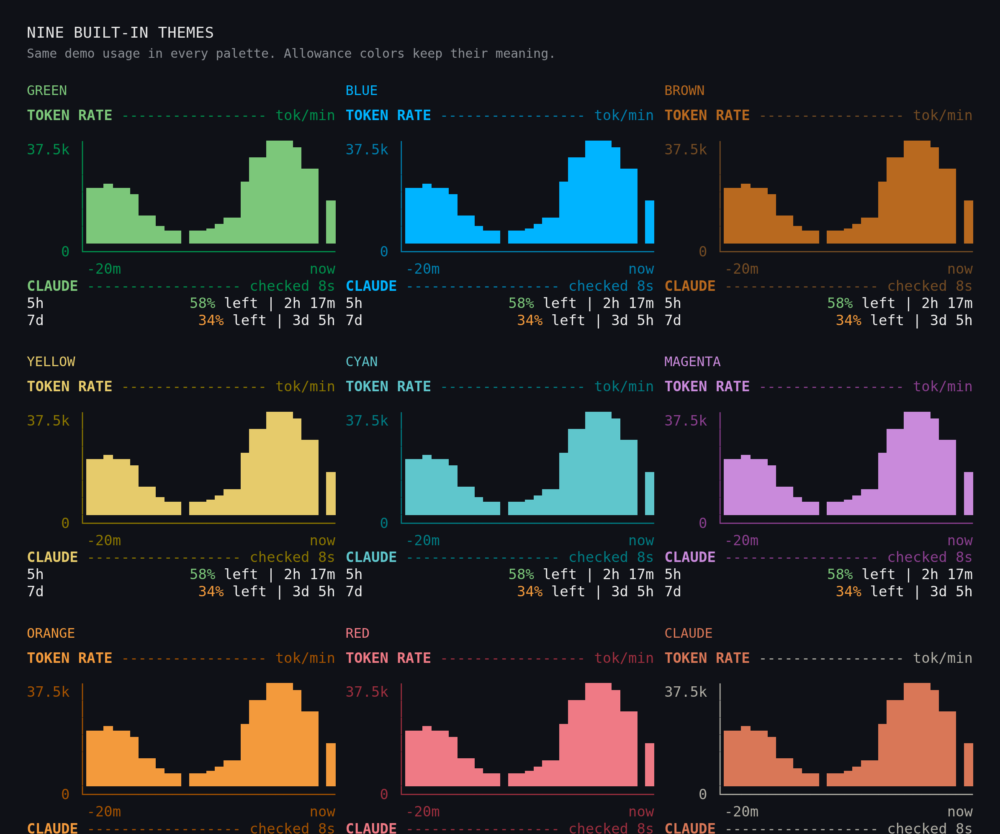

# Harness Useful Sidebar

Live token charts and persistent session history for [Oh My Pi (OMP)](https://github.com/can1357/oh-my-pi) in a tmux sidebar and for Claude Code in a native Pane.

For OMP, see how quickly your current session is using tokens, what your previous session consumed, and how much account allowance remains—without leaving the terminal. Token usage stays attributed to the provider and model that handled each request, even when you switch models. Session history and dashboard preferences persist across restarts. The independent Claude Code mod records native reported request usage and displays fresh native rate-limit observations when available; it does not use OMP's provider accounting or provide account-specific quota-change history.

**Your recorded usage history stays on your machine.** Session token records and OMP's observed quota changes are saved in local SQLite databases, not a hosted dashboard service. OMP and Claude Code use physically separate data directories and JSON settings. See [Settings and privacy](#settings-and-privacy) for file locations and exactly what is stored.

[Install](#installation) · [Use](#usage) · [Themes](#theme-preview) · [Update](#updating) · [Uninstall](#uninstalling) · [Troubleshoot](#troubleshooting)

Inside either host, use `/useful-sidebar view compact` for the overview or `/useful-sidebar view details` for per-model token accounting. OMP's command and Claude's immediate native command are separate integrations; only OMP records observed account-specific session quota changes.

## What it does

- **Live token-rate chart:** choose bars (the default), dots, or trace to view the same last 20 minutes of reported usage across all models, with an idle state and terminal-friendly rendering.
- **Current and previous sessions:** cumulative token totals persist across restarts. OMP also records allowance comparisons; Claude Code does not provide account-specific quota-change history.
- **Provider and model breakdowns:** OMP Compact mode groups tokens by provider; Details separates each model by effective thinking level and includes input/output and cache-read/write counts. Unattributed task aggregates remain explicitly labelled. Claude Code records complete native reported usage separately, with model and thinking level only where the host exposes them.
- **Observed quota changes (OMP only):** Compact shows separate comparisons for each account and allowance window, in percentage points. Rows appear only when comparable samples exist; these are observations, not exact session billing.
- **Account allowances and balances:** OMP displays remaining percentages, reset times, and reported API credit balances where supported. Claude Code displays allowance windows only when a fresh native event reports them for the current session activation.
- **A quieter sidebar:** aligned values, section dividers, and spacing; no pending-sample rows or redundant single-provider totals in Compact mode.
- **Local storage:** recorded usage lives in host-separated SQLite databases. OMP records are scoped by project within each OMP profile; Claude Code records are scoped by project in Claude's own storage. Preferences persist in separate local JSON files.
- **Design-token theming:** choose from nine named palettes: green, blue, brown, yellow, cyan, magenta, orange, red, and the opt-in Claude palette inspired by Anthropic's brand colors. Rules, chart marks, and body text follow each palette's tokens; healthy, warning, and critical values stay green, orange, and red for clear allowance semantics.
- **Host-specific updates:** each host uses its own native plugin manager for marketplace installations; source checkouts remain a manual development path.

### When it is useful

| Use case | How the dashboard helps |
| --- | --- |
| Follow token activity while working | Watch the reported tokens-per-minute chart and current session total in either host. |
| Compare this session with the last one | Keep the previous session's token totals; OMP also preserves available quota comparisons after `/new`. |
| Work across models and providers in OMP | Preserve each request's provider/model attribution and inspect input/output/cache breakdowns. |
| Plan work around subscription limits | See remaining allowance and reported reset times when supported; Claude Code native limits may be unavailable. |
| Reduce unnecessary information in OMP | Use Compact mode, hide providers or account windows, and omit quota comparisons that have no data yet. |
| Monitor prepaid API accounts in OMP | Read the provider's reported credit balance alongside other account views. |

**What it is not:** exact subscription billing attribution, a billing forecast, a universal quota API, or a replacement for host authentication. OMP's `claude`/`anthropic` provider view is **not** standalone Claude Code session accounting: OMP-provider token counts do not equal Claude Code session counts. Token totals and account percentages are different measurements; percentages are never added across providers or distinct allowance windows. Unsupported or missing account usage is shown as unavailable, and unmeasured changes stay hidden—not presented as an invented zero.

## Requirements

| Component | Requirement |
| --- | --- |
| Operating system | Linux or macOS. Linux is verified for OMP and Claude's terminal Pane; macOS, Claude Desktop painting, and successful live Claude accounting have not been verified here. |
| OMP path | OMP installed on `PATH`, with `omp usage` support. Historical session-accounting verification used OMP 18.1.21; the native-cutover launch/sidebar/control smoke used OMP 18.4.10. Managed updates require native marketplace commands. Not required for Claude Code. |
| Claude Code path | Claude CLI 2.1.287 or later with native mods enabled; independent of OMP. Check `claude --version` and upgrade the global CLI yourself if needed. The dashboard does not ship or upgrade the runtime. |
| Python | Python 3.10+ with standard-library `sqlite3`; OMP additionally requires `curses`. Claude's native helper does not import curses. |
| tmux | OMP only: version 3.3 or later. Claude's native mod does not require tmux. |
| Git | Required for OMP marketplace Git sources and source-checkout installation; also used for Claude's GitHub marketplace or manual checkout updates. |
| Terminal application | OMP text requires tmux and curses. Inline OMP images require native SIXEL support in the terminal, tmux build, and attached client. Claude draws through its own native UI surface. |
| Automatic shell integration | OMP uses its bash, zsh, or fish hook. Claude loads a native plugin, with no new shell function or wrapper. |
| Terminal width | OMP requires at least 96 columns to open the 34-column sidebar. Claude controls Pane placement and can switch from docked to inline when resized. |

**Terminal-agnostic OMP dashboard; pane-managed OMP images.** Use your preferred terminal application for the OMP sidebar. It uses tmux and curses rather than a terminal-specific API or plugin. tmux is required for OMP, but you do not need to start it manually: OMP's installed shell hook starts a session or attaches the dashboard inside an existing one. Neither host's binary nor renderer is patched. When the tmux build reports `sixel_support=1` and every client attached to the OMP pane's session advertises SIXEL, the launcher sets process-local defaults `PI_FORCE_IMAGE_PROTOCOL=sixel` and `PI_ALLOW_SIXEL_PASSTHROUGH=1`. Explicit shell values remain unchanged. Fresh panes wait briefly for a client before capability selection. Unsupported or unknown capabilities leave OMP's protocol selection unchanged; inline previews are not guaranteed in that case.

While OMP is dashboard-managed, its pane has tmux `allow-passthrough=off`, including when the sidebar is hidden. Window and sidebar settings are left alone. On detach, the OMP pane's prior explicit setting is restored unless it was changed outside the dashboard.

**Pane size and image ownership.** tmux exposes the OMP pane's own dimensions and resize events. Image-width limits alone do not prevent misplaced graphics: raw passthrough bypasses tmux's pane grid, so direct image placements can cover unrelated text or sibling panes after redraw or resize. Native SIXEL instead passes through tmux's parser and image lifecycle. OMP's `PI_ALLOW_SIXEL_PASSTHROUGH` permits SIXEL bytes in its renderer; it does **not** enable tmux's raw DCS passthrough. The dashboard does not force terminal dimensions or enable raw passthrough as a fallback.

<details>
<summary>Install operating-system prerequisites</summary>

For the OMP path, install OMP using its [official instructions](https://github.com/can1357/oh-my-pi). For the separate Claude Code path, install or manually upgrade the Claude CLI using its [official instructions](https://code.claude.com/docs/en/setup). The commands below install OMP's prerequisites; Claude needs Python and, for Git sources, Git, but not tmux or curses:

```sh
# Arch / CachyOS
sudo pacman -S --needed python tmux git

# Debian / Ubuntu — check that your release provides the required versions
sudo apt install python3 tmux git

# macOS / Homebrew
brew install python tmux git
```

The OMP installer validates Python, curses, OMP, and tmux. It recognizes an already-installed compatible tmux at `~/.local/share/harness-useful-sidebar/vendor/usr/bin/tmux` and does not download or bundle tmux. Claude's native plugin uses `python3` to invoke its packaged helper and leaves the globally installed CLI unchanged.

</details>

## Installation
Choose **one or both** independent host integrations. OMP installation uses its native marketplace plus an OMP shell hook; Claude Code uses a native marketplace plugin or a local development directory, without requiring OMP.

### Recommended for OMP: marketplace

Marketplace installation requires a published [catalog](https://github.com/MSpiechowicz/harness-useful-sidebar/blob/main/.omp-plugin/marketplace.json) and its referenced [release tag](https://github.com/MSpiechowicz/harness-useful-sidebar/releases) containing the plugin. Until both are available, use the [source-checkout method](#alternative-source-checkout).

**1. Register the marketplace and install the plugin.** Run these commands in your shell:

```sh
omp plugin marketplace add MSpiechowicz/harness-useful-sidebar
omp plugin install harness-useful-sidebar@harness-useful-sidebar --scope user
```

**2. Enable automatic sidebar launch with ordinary `omp`.**

```sh
python3 ~/.omp/plugins/node_modules/harness-useful-sidebar/install.py --native
```

Use the stable **`node_modules` path**, not a versioned cache directory. Native upgrades change its target, so the shell hook continues to launch the installed version. OMP remains responsible for extension discovery, enablement, and project-over-user precedence; native setup does not create a duplicate agent extension.

**3. Start OMP.**

```sh
omp
```

After installation, open a new terminal tab or window so your shell loads the integration, then run `omp`. Restart any existing OMP processes to load the extension. Log in to your providers through OMP as usual; the dashboard does not have a separate login flow. Shell-specific activation options are listed below.

For other installation layouts, use the matching stable package path:

| Layout | Installer path |
| --- | --- |
| Default user installation | `~/.omp/plugins/node_modules/harness-useful-sidebar/install.py` |
| Active XDG data layout | `$XDG_DATA_HOME/omp/plugins/node_modules/harness-useful-sidebar/install.py` |
| Project installation | `<project>/.omp/plugins/node_modules/harness-useful-sidebar/install.py` |

For project scope, run `omp plugin install harness-useful-sidebar@harness-useful-sidebar --scope project` from the project root, then configure its stable installer path with `--native`.

### Alternative: source checkout

Use this for development or until the catalog and release described above are published:

```sh
git clone https://github.com/MSpiechowicz/harness-useful-sidebar.git
cd harness-useful-sidebar
python3 install.py
```

Then run `omp`, using the shell-activation guidance above. **Keep the checkout in place:** the shell hook and extension point to its files. This installation is not managed by native marketplace upgrades; see [Updating a source checkout](#updating-a-source-checkout).

### Claude Code: native plugin

Install Claude CLI **2.1.287 or later** and Python **3.10+** first. The runtime is not bundled with this dashboard. Check the actual CLI:

```sh
command claude --version
```

The commands below use `command claude` so a shell function or alias cannot intercept installation.

**Current checkout / local development:** use the checkout containing these native files, not an installed version cache:

```sh
command claude --plugin-dir /absolute/path/to/harness-useful-sidebar
```

From this checkout root, `command claude --plugin-dir .` also works. Claude watches development modules for reloads. Keep the checkout in place, and avoid loading a marketplace copy of the same plugin simultaneously. For a local catalog installation instead, replace the example path with your checkout's actual absolute path:

```sh
command claude plugin marketplace add /absolute/path/to/harness-useful-sidebar
command claude plugin install harness-useful-sidebar@harness-useful-sidebar --scope user
```

The catalog is `.claude-plugin/marketplace.json`, whose plugin source is the repository root (`./`). Use `--plugin-dir` for active edits: version-cached installed copies do not necessarily reflect checkout changes.

**Future published GitHub versions:** once the native manifest, catalog, and corresponding code are published, users can install them with:

```sh
command claude plugin marketplace add MSpiechowicz/harness-useful-sidebar
command claude plugin install harness-useful-sidebar@harness-useful-sidebar --scope user
```

These GitHub commands fetch published repository content, **not uncommitted local changes**. This cutover does not itself bump a version or publish a release. Until a native version is available there, use the current checkout or local catalog above.

Restart Claude after installation and confirm the plugin is enabled in `/plugin`. Workspace trust, safe/bare mode, disabled hooks, and organizational mod policy can prevent loading; see [Claude's mod troubleshooting](https://code.claude.com/docs/en/plugins/mods/troubleshoot). The plugin registers an immediate `/useful-sidebar` command and opens a native Pane where the surface supports it. It does not install a personal skill, shell wrapper, or OMP extension.

### Migrating a source installation to the marketplace

1. Exit OMP and run `python3 install.py --uninstall` from the original checkout. Repeat with `--agent-dir PATH` for any custom agent directories previously configured.
2. Follow the marketplace installation steps above.
3. Open a new shell to discard the old loaded function, then run `omp`.

Uninstalling the source integration preserves your preferences, credentials, and checkout. Do not delete your OMP agent directory.

<details>
<summary>Shell selection and manual activation</summary>

The installer detects your shell by default. To choose explicitly, add `--shell fish`, `--shell bash`, `--shell zsh`, or `--shell all`. Keep `--native` when configuring a marketplace installation. `--shell none` skips adding a shell hook; it does not remove an existing one.

These options select your **shell**, not your terminal application. Bash and zsh load the hook in a new shell; fish can also autoload it in an already-open shell unless an existing function takes precedence. Opening a new shell is the common activation path.

If needed, activate the hook manually using only the command for your shell:

```sh
# Fish
source ~/.config/fish/functions/omp.fish

# Bash
source ~/.config/harness-useful-sidebar/bash.sh

# Zsh
source ~/.config/harness-useful-sidebar/zsh.sh
```

These paths follow `XDG_CONFIG_HOME` when set. Existing aliases, functions, abbreviations, or unowned destination files can block installation rather than being overwritten. Resolve those conflicts deliberately. Bash login shells must load `.bashrc`; custom startup arrangements may require manual sourcing. Symlinked rc files are not rewritten.

</details>

## Usage

### Claude Code usage

Start Claude with the native plugin installed/enabled, or with `command claude --plugin-dir /absolute/path/to/harness-useful-sidebar` for development. `--continue` and resume use Claude's normal session handling. Bare `/useful-sidebar` opens a focused **Dashboard Settings** pane, not model-mediated personal skill guidance. It lists one picker per setting in the order the dashboard draws them: **Dashboard** (on/off), **View**, **Theme**, then under **Sections**: **Token rate** with its **Chart style**, **Current session**, **Previous session**, **History other sessions**, **History total**, **Claude** with its **5h limit** and **7d limit** windows, and **Commands**. Arrow keys move, Enter picks, and Esc closes it. Each pick saves immediately through the same validation as the direct command. Opening settings does not open or enable the dashboard Pane, which stays read-only.

Fresh native preferences select `anthropic`, Compact mode, bars, the green theme, and an enabled Pane. Existing Claude preferences and token history are retained separately from OMP.

The settings pane replaces the earlier popup menus, whose two-to-four-choice limit forced **Next**/**Back** paging. Custom colors and other window filters remain direct commands (`theme custom TOKEN COLOR`, `window hide|show anthropic FILTER`). A nonrendering/headless run returns readable snapshot text and direct-command help without opening a Pane.

Use one command at a time:

```text
/useful-sidebar
/useful-sidebar help
/useful-sidebar view list
/useful-sidebar view compact
/useful-sidebar view details
/useful-sidebar chart bars
/useful-sidebar chart dots
/useful-sidebar chart trace
/useful-sidebar previous hide
/useful-sidebar previous show
/useful-sidebar commands hide
/useful-sidebar commands show
/useful-sidebar history-other hide
/useful-sidebar history-other show
/useful-sidebar history-total hide
/useful-sidebar history-total show
/useful-sidebar window on
/useful-sidebar window off
/useful-sidebar window focus
/useful-sidebar window refresh
```

The Pane is a **read-only usage display**: usage rows and required capture/storage warnings, without the permanent token-qualification banner. Allowance and token-capture status share one **CLAUDE** section but remain independent: account allowance can be known while token coverage is unknown or incomplete, and accepted token reports do not establish account allowance. Hiding/removing Anthropic hides its allowance, not required capture warnings or recorded tokens. There are no permanent View, Chart, Theme, visibility, Setting, Refresh, or Close controls, and no dashboard `r`/`x` buttons. Optional **COMMANDS** help remains controlled by `commands hide` / `commands show`.

Use the menu's **Window** actions or their direct equivalents: `/useful-sidebar window on` enables and reopens the Pane; `window focus` opens/focuses it without changing its saved enabled preference; `window refresh` reads the local snapshot. `window off` and a user-initiated close save the disabled preference. Escape can close a focused Pane. Bare `/useful-sidebar` opens only the menu, so use **Window → On** or the explicit command to enable a disabled Pane again.

Routine interactive commands return confirmations, settings/help, and any required diagnostics without copying the chart into the transcript—even when the Pane is hidden or disabled. Full snapshot text is reserved for nonrendering/headless sessions and explicit `window on` / `window focus` placement refusal. `window off` stays concise in either mode.

**Claude owns placement; events replace polling.** Native controls do not support `position left|right` or `window interval`. Old saved side/interval values remain untouched but do not control the native Pane. `window refresh` reads the local snapshot; it does not poll an account API or make an old allowance observation fresh. A small layout timer adapts text to changed Pane width, not token or provider polling.

Claude also owns the outer Pane background. The plugin sets foreground colors only; the **2.1.288** SDK exposes no supported outer-background or transparent/inherit override. A Pane/main-transcript background difference is therefore not corrected by guessing a background hex value.

All nine palettes are available:

```text
/useful-sidebar theme green
/useful-sidebar theme blue
/useful-sidebar theme brown
/useful-sidebar theme yellow
/useful-sidebar theme cyan
/useful-sidebar theme magenta
/useful-sidebar theme orange
/useful-sidebar theme red
/useful-sidebar theme claude
/useful-sidebar theme custom accent #58a66a
/useful-sidebar theme custom chart #58a66a
/useful-sidebar theme reset
```

Choosing a named theme keeps custom overrides. `theme reset` restores green **and clears all overrides**. Supported custom tokens are `text`, `muted`, `secondary`, `accent`, `chart`, `good`, `warn`, and `error`.

Claude supports only the Anthropic provider view. These are alternatives, not a sequence:

```text
/useful-sidebar providers add anthropic
/useful-sidebar providers remove anthropic
/useful-sidebar providers hide anthropic
/useful-sidebar providers show anthropic
/useful-sidebar window hide anthropic five_hour
/useful-sidebar window show anthropic five_hour
/useful-sidebar window hide anthropic seven_day
/useful-sidebar window show anthropic seven_day
```

Provider removal also removes its window filters; hiding retains settings. Window filters match reported labels or IDs, and cannot manufacture missing allowance data. Use a filter matching the actual native report if its window IDs differ.

#### Native accounting and coverage

The mod observes complete native main/subagent step results and reported compaction usage, deduplicates stable request identities, and sends only allowlisted scalar metadata and counters to its packaged Python helper. Aggregate turn totals are not added again. Lifecycle handling binds each report to its original session and activation so reload, clear, branch, resume, and late completions do not switch its owner. It does not infer usage from transcripts, elapsed time, account allowance, prompts, or responses.

**Normalization caveat:** the native result must contain all four nonnegative safe-integer counters: `input_tokens`, `output_tokens`, `cache_read_input_tokens`, and `cache_creation_input_tokens`, and their sum must also be a safe integer. Claude CLI normalizes upstream omitted counters to zero before exposing a result. The dashboard accepts that host report; it cannot distinguish an upstream omission from a genuine reported zero. If a counter is missing from the native result, the dashboard does **not** guess it. Total is the sum of the four reported counters.

Compaction's responding model is **unknown** when the host does not expose it. A compaction result without usage is ambiguous: it can mean a reused summary or unreported work, so coverage stays unknown/incomplete rather than inventing a request or asserting a billed loss. Thinking level is likewise unknown unless exposed by the host. Capture warnings preserve previously saved history, and helper failures do not replace the host's original result or error.

These totals count **observed reports**, not exact subscription billing. Successful live native main/subagent/retry/compaction accounting has not been verified here; the latest live request returned **401, expired OAuth access token**. Missing reports mean unknown coverage, not measured zero. Offline tests and seeded local reports prove local accounting behavior, not service-side completeness.

Allowance windows come from Claude's native rate-limit readings for the current session activation: the last reported reading seeds a new activation or plugin reload, and each turn's measurement renews it. An idle session keeps its last reading and notes its age (**Last updated 20m ago**) once it is older than five minutes; wrong-session observations become unknown. Claude exposes no stable account identity for this integration, so there is **no Claude account-quota-change history**. OMP's `claude` provider view cannot fill missing Claude Code session usage.


### OMP usage

Run `omp` normally, including `omp --resume` or `omp --continue`. Fresh installs start with **no providers selected**, on the right, in compact mode, polling every 60 seconds. The sidebar prompts you to add at least one provider: run `/useful-sidebar providers`, choose **add**, then select a provider you use. Existing saved provider selections are preserved.

### OMP commands and settings

The following slash commands and provider-management guidance apply **only inside OMP**. Claude Code has its own immediate native `/useful-sidebar` command and Pane; shared rendering descriptions below do not make OMP's per-provider measurements into Claude session accounting.

Inside OMP, enter:

```text
/useful-sidebar
```
The menu has eight sections, including **Chart**: select Chart, then choose Bars (default), Dots, or Trace. Use the **Left Arrow** to return to the section list, or **Esc** to cancel. Entering a section directly, such as `/useful-sidebar chart` or `/useful-sidebar providers`, opens its submenu.

Dashboard command results, help, warnings, and errors use a bold **Useful Sidebar** heading and readable body text in the active OMP theme. Warning and error headings retain their severity colors. Update check/install notifications keep their native presentation.

| Section | Purpose | Example |
| --- | --- | --- |
| **View** | Switch between provider and model-level display; use `view list` directly to inspect settings | `/useful-sidebar view details` |
| **Chart** | Select the saved token-rate visualization without changing recorded usage | `/useful-sidebar chart trace` |
| **Section Visibility** | Show or hide Token Rate, Current, Previous, History Other Sessions, History Total, or Commands | `/useful-sidebar history-other hide` |
| **Position** | Move the sidebar left or right | `/useful-sidebar position left` |
| **Theme** | Choose a named palette or customize individual color tokens | `/useful-sidebar theme blue` |
| **Providers** | Add, remove, hide, or restore provider views | `/useful-sidebar providers add claude` |
| **Window** | Control the sidebar, polling, and usage-window filters | `/useful-sidebar window interval 60` |
| **Update** | Check for or install a dashboard release | `/useful-sidebar update check` |

To select a chart without opening the menu, enter one of these commands in OMP (one at a time):

```text
/useful-sidebar chart bars
/useful-sidebar chart dots
/useful-sidebar chart trace
```

**Section Visibility** controls each section independently in Compact and Details (`token-rate`, `current`, `previous`, `history-other`, `history-total`, `commands`, each `hide|show`). All are visible by default when applicable. Hiding Previous removes the previous-session section; History Other Sessions and History Total can each be hidden without hiding the other. These settings only affect presentation: recording continues, stored usage is preserved, and Show restores the accumulated data. The former `history hide|show` command is replaced by `history-other hide|show` and `history-total hide|show`. Existing saved History visibility initializes both new settings, so previously hidden history stays hidden.

### Common tasks

```text
/useful-sidebar providers add claude
/useful-sidebar providers add copilot
/useful-sidebar window hide codex spark
/useful-sidebar theme blue
/useful-sidebar theme custom accent #58a66a
/useful-sidebar view compact
/useful-sidebar chart trace
```

**Provider visibility and usage-window filters are separate:**

- `/useful-sidebar providers hide codex` hides the whole Codex view but retains its selection and filters.
- `/useful-sidebar window hide codex spark` hides only Codex rows whose label or ID contains `spark`.
- Replace `hide` with `show` to undo the corresponding action. Showing a usage window does not unhide its provider.
- `/useful-sidebar providers remove codex` removes that view and its saved filters. It does not log you out of OMP.

Window filters are case-insensitive substrings of provider usage-window labels or IDs, **not tmux windows**.

### Theme preview

[](docs/assets/themes.png)

*Mock-data excerpts of the original eight palettes showing the bars style, not a preview of the Claude palette or other chart styles. Each uses the same values to compare accents, darker rules, and chart colors. The blue tile is historical: it shows the former dark blue, not the current bright cyan-blue `#00b4ff` accent and chart with `#007fae` rules. Exact shades and dimming depend on your terminal palette and color support. Click to enlarge.*

Choose a palette from `/useful-sidebar theme`, or enter a command directly:

```text
/useful-sidebar theme cyan
/useful-sidebar theme claude
/useful-sidebar theme custom accent #58a66a
/useful-sidebar theme custom chart #58a66a
/useful-sidebar theme reset
```

`accent` changes section headings; `chart` changes the chart marks; `secondary` changes rules and axes. The original eight palettes use neutral body text and darker secondary rules; Claude instead uses warm light body text and a mid-gray secondary token. All built-in palettes keep allowance colors semantic: green for healthy, orange at 40% remaining or below (or a reported warning/unknown status), and red at 20% or below (or exhausted). Custom overrides can change those tokens too. `reset` restores green and clears all overrides. Preferences persist across launches.

<details>
<summary>Complete command reference</summary>

All commands below are entered inside OMP.

| Command | Effect |
| --- | --- |
| `/useful-sidebar view list` | Show the current configuration. |
| `/useful-sidebar view compact` | Show the token chart, concise session/provider totals, measured quota changes, and dense allowance rows. |
| `/useful-sidebar view details` | Enable model-and-thinking-level rows for current/previous sessions and both history totals, including input/output and cache-read/write counts. |
| `/useful-sidebar chart bars|dots|trace` | Select the chart style (bars by default) using the same token-rate buckets. For example, `/useful-sidebar chart trace`; omit the style to open the Chart submenu. |
| `/useful-sidebar commands hide` | Hide the Commands footer and use its space for dashboard content. Keyboard shortcuts and scrolling remain available. |
| `/useful-sidebar commands show` | Restore the Commands footer (visible by default). |
| `/useful-sidebar previous hide` | Hide the Previous session section without changing recorded usage. |
| `/useful-sidebar previous show` | Restore the Previous session section (visible by default when available). |
| `/useful-sidebar history-other hide` | Hide History Other Sessions without changing History Total or recorded usage. |
| `/useful-sidebar history-other show` | Restore History Other Sessions (visible by default when available). |
| `/useful-sidebar history-total hide` | Hide History Total without changing History Other Sessions or recorded usage. |
| `/useful-sidebar history-total show` | Restore History Total (visible by default when available). |
| `/useful-sidebar position left` | Place the sidebar on the left. |
| `/useful-sidebar position right` | Place the sidebar on the right. |
| `/useful-sidebar theme green|blue|brown|yellow|cyan|magenta|orange|red|claude` | Choose one of nine named design-token palettes; `claude` opts into Anthropic brand-inspired colors. |
| `/useful-sidebar theme custom TOKEN COLOR` | Override one token on the selected palette. Tokens are `text`, `muted`, `secondary`, `accent`, `chart`, `good`, `warn`, and `error`; colors can be terminal names, `gray`, `brown`, `orange`, or `#RRGGBB`. Example: `/useful-sidebar theme custom accent #58a66a`. |
| `/useful-sidebar theme reset` | Restore the green palette and remove custom token overrides. |
| `/useful-sidebar providers add ID` | Add a provider view. |
| `/useful-sidebar providers remove ID` | Remove a provider view and its filters. |
| `/useful-sidebar providers hide ID` | Hide a whole provider while retaining its settings. |
| `/useful-sidebar providers show ID` | Show a provider view. |
| `/useful-sidebar window on` | Open the sidebar and remember it as enabled. |
| `/useful-sidebar window off` | Close the sidebar and remember it as disabled. |
| `/useful-sidebar window focus` | Move keyboard focus to the sidebar. |
| `/useful-sidebar window refresh` | Request a fresh usage poll. |
| `/useful-sidebar window interval SECONDS` | Set the polling interval; minimum 15 seconds. |
| `/useful-sidebar window hide ID FILTER` | Hide matching usage-window rows. |
| `/useful-sidebar window show ID FILTER` | Remove a matching usage-window filter. |
| `/useful-sidebar update check` | Check for the latest stable dashboard release. |
| `/useful-sidebar update install` | Upgrade this registered marketplace installation through OMP. |

</details>

### Mouse and keyboard

Click the sidebar to focus it; click the OMP pane to return to your prompt. In the sidebar:

| Control | Action |
| --- | --- |
| **Refresh** button or **r** | Request fresh usage data. |
| **Hide** button or **q** | Close the sidebar and save the off state. |
| Mouse wheel or **Up/Down** | Scroll session history, model breakdowns, and provider views. |

With default tmux bindings, **Ctrl-b**, then **o**, switches panes. Your terminal may allow **Shift**-selection to bypass tmux mouse handling.

### Reading the numbers

Percentages in the account-allowance section mean **remaining allowance**: green above 40%, amber above 20% through 40%, and red at 20% or below. Labels and reset times remain neutral. Credit balances stay in their reported currency rather than becoming an estimated percentage.

`checked Ns` in the provider heading describes the dashboard's last completed poll, not the age of the provider's data, in both Compact and Details modes. Old source data still shows its age and is marked as cached; failed refreshes retain the last successful report with **STALE DATA**. Details mode adds window IDs without repeating the used percentage; reset credits follow the final window ID without a blank row. The dashboard invalidates the selected provider's OMP usage cache before polling, but cannot force an upstream counter to change. If the terminal pauses the dashboard loop while its tab is inactive, in-flight polls are discarded and restarted when the loop resumes; failed polls retry within 15 seconds instead of waiting for the full interval. Hidden providers are not polled. Keep the default 60-second interval unless you have a reason to change it; shorter intervals can encounter rate limits.

### Live chart and session history

The **Token rate** chart shows reported tokens per minute across all models in 20 one-minute buckets, including the current, incomplete minute. Bars is the default and preserves the original solid, fractional-cell bar chart. Choose any of three styles in either host; this changes only the presentation, not accounting or stored records:

| Style | How to read it |
| --- | --- |
| `bars` | Solid vertical columns with fractional terminal cells across six plot rows. |
| `dots` | Sparse markers for active minutes across six plot rows, without connecting segments; even the smallest positive minute occupies the bottom plot row. |
| `trace` | A six-row connected linear per-minute Braille rate line. Rising from zero and falling back to zero touch the plot's lowest subpixel row beside the axis, while long zero-only stretches remain unpainted. Tiny positive samples remain visible at that lowest subpixel; there is no extra horizontal zero line. ASCII-only terminals use readable line characters instead of Braille. |

In OMP choose **Chart** from `/useful-sidebar` or run `/useful-sidebar chart TYPE`; inside Claude Code use its immediate native `/useful-sidebar chart TYPE` command. Replace `TYPE` with `bars`, `dots`, or `trace`. Chart style is a saved preference for each host, independent of Compact/Details mode and of the other host's settings. Previously saved `line`, `area`, `heatmap`, or `lollipop` values fall back to bars and are normalized to bars on the next save.

All three styles have one blank row above six plot rows, then an immediately adjacent open bottom axis and aligned `-20m`/`now` time labels. The existing blank row after the labels separates the chart from the session summary, including for trace; no extra caption or idle-only message occupies either margin. The peak appears at the top only when usage is present, and a single `0` labels the baseline, including when idle. In a narrow sidebar, bars and dots may max-pool adjacent minutes into a visible column so peaks remain visible; trace plots the connected linear samples of all 20 minutes without a right rail or midpoint tick. With no recent usage, the plot stays empty while its axes and time labels remain visible. Small panels scroll to show additional rows. ASCII-only terminals use readable fallback characters for all three styles. Token records update on completed usage events, with a one-second check for auxiliary model usage even while the parent is idle.

Claude keeps the current session's chart frame visible before any native usage report has been accepted. **Awaiting native usage** appears below the chart heading, before the existing blank margin; the session's token total remains **unknown**. The baseline `0` is an axis coordinate, not a measured zero-token report. An accepted zero report removes the awaiting message and shows its reported zero total. Positive reports populate the selected chart normally; incomplete capture keeps observed samples visible alongside its warning.

The one-second auxiliary-usage check above belongs to OMP. Claude captures usage only from native completed-step and compaction reports. While its native pane is shown and placed on a rendering surface, a local presentation timer checks every 500 ms: snapshots refresh at minute boundaries for the rolling chart, every second for reset countdowns below one hour, and at the earliest allowance reset or 300-second observation expiry. Hidden, unplaced and nonrendering panes do not launch timer-driven helpers. Refreshes are serialized with at most one pending timer refresh; a busy helper can delay the display. This reads only local history and the existing allowance observation: it neither polls a provider nor makes an observation fresh. Reset windows disappear independently, and observations older than 300 seconds become unknown.

**Current session** and **Previous session** show cumulative reported token totals. Compact mode groups them by provider; `/useful-sidebar view details` separates each model by thinking level, for example `Luna - Max tokens` and `Luna - xHigh tokens`. Each row includes input/output and cache-read/write counts. Switching models or thinking levels never reassigns earlier usage. Cached tokens remain part of the provider's reported total, not an extra amount added on top of it.

Cache-write counts are reported values, not estimates of how much input might be cached. `w 0` can mean zero writes or that the upstream provider/runtime did not report a separate write count; it does not imply cache reads are broken. OMP's [Codex adapter](https://github.com/can1357/oh-my-pi/blob/main/packages/ai/src/providers/openai-codex-responses.ts) reads the optional `input_tokens_details.cache_write_tokens` field, and its [shared usage accounting](https://github.com/can1357/oh-my-pi/blob/main/packages/ai/src/providers/openai-shared.ts) defaults an absent write count to zero. The dashboard preserves the normalized `cacheWrite` value across current, previous, and project history; it cannot reconstruct an unreported count.

Each refresh reads one consistent database snapshot, so the chart and session/project totals cannot mix records from before and after an incoming usage update. Chart buckets contain the sum of individual request totals for that minute, not the cumulative session total: requests of 370k and 17k in consecutive minutes produce chart values of 370k and 17k in the selected style, and a session total of 387k. Compact numbers preserve significant zeroes (`170k` stays `170k`, not `17k`).

Section dividers separate token rate, session summaries, both history sections, and account allowances. Section labels such as TOKEN TRACE, CURRENT SESSION, HISTORY TOTAL, and provider names are bold and use the theme accent color on color terminals; on monochrome terminals they are bold without color. The divider rule and right-side detail stay in the secondary color. Every section has a blank separator row in Compact and Details modes; Details also separates model, history, and provider entries for readability. Each history section has its own heading and Tokens total row. In Details, provider totals under Current/Previous session and history Tokens totals use the same bold theme-colored headings with totals at the right. Model names retain normal text contrast; input/output and cache-read/write rows use the secondary theme color, like Reset credits. Compact mode avoids repeating the total for a single provider, hides history when the project has no recorded usage, and omits a nonexistent previous session.

**Recorded history** is split into two independently visible sections. **HISTORY OTHER SESSIONS** is the total of locally recorded requests from sessions other than the current one in the current Git repository (or current working directory when no repository root is found). **HISTORY TOTAL** is the aggregate of all recorded requests in the current project, including the current session. In Details mode, both sections expand to the model/thinking-level rows and token dimensions used by the session summaries. `/new` preserves both totals. Resuming the same conversation continues its record, while inherited fork context is excluded from new consumption. Large token totals use compact `k`, `M`, `B`,…

OMP's main-session assistant messages and auxiliary `model_usage` records retain their provider/model attribution. The dashboard also listens for completed native subagent requests, including background tasks while the parent is idle. Each request keeps its actual serving provider/model, including model changes within a child. Native child thinking levels require explicit progress metadata matching that serving model; auxiliary thinking levels come from each record's explicit `thinkingLevel`. Missing or invalid metadata is shown as **unknown**, never as the parent session's selected level. Main-session assistant messages still use the session's effective thinking level.

Newly captured native subagent requests enter the chart in the minute their completed usage event is received, not the minute the request started. A long response therefore updates the recent chart when its usage becomes available instead of filling an older column. Replayed events and storage retries do not move an already recorded request into a newer minute. Existing history and main-session/auxiliary record timestamps are unchanged. An active subagent may still show no new tokens until a request completes; the dashboard does not estimate streaming usage or fill empty minutes.

Captured child requests remain assigned to the session that spawned them, even if the parent switches sessions before they finish. When OMP also reports a task aggregate, the ledger subtracts the captured requests from that aggregate so the same tokens are not counted twice. Any unobserved remainder stays separately labelled **task (mixed)** / **mixed / unattributed**, with unknown thinking. Noninteractive child extensions do not independently record those same requests. Restart OMP after updating to enable native event collection; requests whose events were already missed cannot be retroactively split by model from an aggregate alone.

### Session quota changes in OMP are observations, not exact billing

Each supported account/window gets its own **observed quota change**, shown as a percentage-style delta. For example, an allowance moving from 20% used to 24.2% used contributes **+4.20%**, meaning **+4.20 percentage points**. Hourly, five-hour, weekly, monthly, or other labels come from the provider; the dashboard does not invent an hourly or total quota if none is reported.

Session quota-change rows appear in Compact only, once their measured increase reaches the display threshold. Details omits these session comparisons while retaining per-model token breakdowns and live provider allowance rows.

- Token totals can be combined across models; quota percentages cannot be combined across providers, accounts, or distinct allowance windows. Shared model buckets are observed once, not multiplied by the number of models used.
- Different accounts/buckets remain separate. Short bracketed bucket fingerprints distinguish otherwise identical labels without displaying raw account IDs.
- A fresh baseline and a comparable second sample are required. In Compact, quota rows and their heading stay hidden until the accumulated change rounds to a positive value at two decimal places; there are no “awaiting samples” or “+0.00%” rows. Unchanged samples and smaller increases remain recorded, so small increases can accumulate into a visible change. Old cached samples, late responses from a previous session, and duplicate timestamps do not establish new consumption.
- A changed reset/limit, decreasing counter, or resumed session starts a separate observation segment. The summary adds only observed increases inside those segments; it never subtracts across a reset or charges the inactive resume gap.
- Provider counters can lag and include other sessions, applications, or machines. Changes before the first sample or after the last sample cannot be attributed. These values are **not exact per-session or per-model subscription charges**, and tokens are not converted into quota percentages or dollar charges.
- Account sampling runs at the configured polling interval while the sidebar and provider view are visible. Hidden providers are not polled. A provider without a stable account scope or percentage cannot produce a session quota comparison; its quota summary stays hidden rather than implying zero. Historical summaries remain visible regardless of the current account-view filters.

Restart OMP after updating the extension to enable collection. Token recording continues when the sidebar is hidden; account-quota sampling does not.

## Provider availability

Authentication for the providers below stays in OMP. These are OMP provider views, **not** standalone Claude Code usage. Availability depends on the provider endpoint, account plan, and credential type.

| Input | OMP provider ID | What can be displayed |
| --- | --- | --- |
| `codex` | `openai-codex` | Reported allowance windows and reset times. Verified with live credentials. |
| `claude` | `anthropic` | Usage windows when the account and credentials support them. |
| `copilot` | `github-copilot` | Reported usage and allowances when available. |
| `gemini` | `google-gemini-cli` | Usage exposed by OMP's Gemini CLI adapter. |
| `deepseek` | `deepseek` | Reported API credit balance; official balance endpoint fallback. Not a subscription quota. |
| `grok` | `xai` | Usage only when OMP supplies a compatible report. |
| `xai-oauth` | `xai-oauth` | Separate SuperGrok OAuth adapter; select it explicitly. |

Other provider IDs are accepted when OMP can supply a compatible report. Live credential-dependent behavior for providers other than Codex has not been verified here. Ordinary xAI API credentials do not imply access to SuperGrok quotas or management billing.

## Settings and privacy

**The dashboard stores its recorded usage history locally on the machine running the selected host.** It does not upload history to a dashboard server or synchronize it between machines. OMP provider usage polling and GitHub release checks still require network requests; Claude Code itself communicates with its service. Local storage does not mean either host operates entirely offline.

### Local usage databases

OMP session token records and observed account-quota changes are stored in **`useful-sidebar.sqlite3`**, a local SQLite database. There is one database per OMP profile, with project-scoped records inside it—not a separate database file for every project.

| Configuration | Usage database |
| --- | --- |
| Default | `~/.omp/agent/useful-sidebar.sqlite3` |
| Custom default agent directory | `$PI_CODING_AGENT_DIR/useful-sidebar.sqlite3` |
| Named profile | `~/.omp/profiles/NAME/agent/useful-sidebar.sqlite3` |

Claude Code instead uses **`~/.claude/useful-sidebar/useful-sidebar.sqlite3`**, or **`$CLAUDE_CONFIG_DIR/useful-sidebar/useful-sidebar.sqlite3`** if `CLAUDE_CONFIG_DIR` is set. Its project-scoped request ledger is physically separate from all OMP profile databases; neither host reads or merges the other's session tokens. Claude Code does not store account-specific quota-change history.

The OMP database is created with owner-only permissions and updated transactionally as usage arrives, not just at shutdown. It stores hashed project scopes, session/request identifiers, timestamps, provider/model/thinking-level identities, numeric token counters, hashed task-group associations and original aggregate counters for deduplication, and quota observation summaries with hashed account/window identities. Charts and session/project totals are derived from those local records.

Ledger and preference storage reject symlinked, foreign-owned, or group/world-writable directory components instead of repairing their permissions. Missing components are created one at a time with mode `0700` and validated before descending, so a first-use directory race cannot redirect access into another host's storage. Existing trusted directory permissions remain unchanged. Root-owned sticky directories such as `/tmp` are allowed only as ancestors, never as the directory containing the ledger or preferences.

Claude's native module passes an explicit allowlist of numeric token counters, provider/model/thinking-level labels, hashed request identities, timestamps, and opaque session/owner/activation identifiers to `claude_native.py` through local JSON stdin/stdout. The helper persists ledger entries and capture health; fresh allowance observations remain in native session state, not account-quota history. It does not read transcripts, forward whole host events, bind a loopback receiver, or inject telemetry or status-line settings. Historical capture-only and obsolete limit data may remain in the existing database but are not reused as native observations.

The usage databases do **not** store prompts, responses, tool output, credentials, raw account IDs, or raw project paths. A crash can lose usage not yet reported or saved, but does not erase already committed session history. Uninstalling either integration leaves its database intact.

### Local settings files

Preferences and, for OMP, release-check metadata also stay on your machine, but are stored in **JSON files, not inside the usage databases**.

OMP provider order, hidden providers, window filters, position, display mode, Commands footer visibility, Previous session visibility, separate History Other Sessions and History Total visibility, polling interval, on/off state, and theme tokens are saved per profile:

| Configuration | Preferences file |
| --- | --- |
| Default | `~/.omp/agent/useful-sidebar.json` |
| Custom default agent directory | `$PI_CODING_AGENT_DIR/useful-sidebar.json` |
| Named profile | `~/.omp/profiles/NAME/agent/useful-sidebar.json` |

Claude Code preferences are stored separately in **`~/.claude/useful-sidebar/useful-sidebar.json`**, or **`$CLAUDE_CONFIG_DIR/useful-sidebar/useful-sidebar.json`** when configured. Its storage does not use `PI_CODING_AGENT_DIR`, OMP named profiles, or the OMP settings file. Native preferences retain charts, palettes/custom tokens, view/filter/section visibility, and enabled state. Saved legacy side/interval fields are preserved but ignored by native placement/event observation.

Use `omp --profile NAME` to select a profile. Keep a custom `PI_CODING_AGENT_DIR` in your launching environment. Source-checkout installations must also register the extension in each custom agent directory using `python3 install.py --agent-dir PATH`.

Changes affect the current dashboard and subsequent launches, not all other already-running instances. Preferences use locked, atomic transforms so concurrent changes to different settings are retained; malformed settings produce an error rather than being silently reset. OMP release-check metadata is stored separately in `useful-sidebar-update.json` beside its preferences file; Claude updates belong to its plugin manager.

The nine named palettes use design tokens: `text`, `muted`, `secondary`, `accent`, `chart`, `good`, `warn`, and `error`. Green is the default. The original eight palettes—green, blue, brown, yellow, cyan, magenta, orange, and red—keep neutral body and muted text while varying headings, darker secondary rules, and chart color; only those eight appear in the [theme preview](#theme-preview). Blue uses bright cyan-blue `#00b4ff` for `accent` and `chart` with medium-bright `#007fae` secondary rules; the preview's blue tile predates these shades.

Opt into `claude` with `/useful-sidebar theme claude` in either host's own command. Inspired by [Anthropic's published brand colors](https://raw.githubusercontent.com/anthropics/skills/main/skills/brand-guidelines/SKILL.md), it sets `text` to warm light `#faf9f5`, `muted` and `secondary` to mid-gray `#b0aea5`, and `accent` and `chart` to orange `#d97757`. This is a dashboard palette for an assumed dark terminal, not a verified match for Claude Code's built-in terminal theme. It does not set a background: OMP inherits the terminal background, while native Claude owns its Pane background. Muted text also uses terminal dimming. Hex colors are mapped to the nearest xterm color on 256-color terminals and the nearest basic color on basic-color terminals, so terminal settings can shift the result.

All built-in palettes preserve allowance semantics: `good` is green, `warn` is orange, and `error` is red; orange falls back to yellow without 256-color support. Custom token values override one token on the selected palette and accept basic terminal color names, `gray`, `brown`, `orange`, or a six-digit hexadecimal value. Use the `custom` menu option to enter a token and color, such as `accent #58a66a`; repeat it for additional tokens, or use `reset` to restore green and remove overrides.

**Do not paste API keys or tokens into dashboard commands.** OMP uses its own authentication, does not store credentials in preference files, and does not render account emails or account/credential IDs. DeepSeek's fallback obtains its credential from OMP and uses it in the provider-fetch process. Claude Code remains responsible for Claude authentication; the native mod does not add an OMP login flow or change credentials, model selection, prompts, or permission policy. OMP release checks contact the public GitHub API without provider credentials.

## Updating

### Marketplace installations

Routine updates require a marketplace registration whose source is `MSpiechowicz/harness-useful-sidebar`.
Inside OMP:

```text
/useful-sidebar update check
/useful-sidebar update install
```

**Restart OMP after installation** to load the updated extension and sidebar. Your saved preferences and credentials are retained.

Every interactive OMP startup requests a fresh release check in the background, so a previously cached “up to date” result does not hide a newly published version. For marketplace installations, a newer version produces a visible warning; use `/useful-sidebar update install` to install it. Checks do not block the prompt or automatically install code. Startup network failures remain quiet; explicit `update check` commands also request fresh release data and report errors.

Source-checkout installations do not offer native marketplace upgrades. Their explicit update check reports the manual `git pull --ff-only` and `python3 install.py` path instead; use the marketplace installation if you want updates managed through OMP.

Installation uses OMP's **native marketplace manager** and preserves the current user/project scope. It refuses unregistered checkouts or mismatched installations instead of overwriting them. OMP's native notification mode currently logs update availability; this extension supplies the visible notice.

You can also use OMP's built-in commands directly:

```text
/marketplace update harness-useful-sidebar
/marketplace upgrade harness-useful-sidebar@harness-useful-sidebar --scope user
```

Or, from your shell:

```sh
omp plugin marketplace update harness-useful-sidebar
omp plugin upgrade harness-useful-sidebar@harness-useful-sidebar --scope user
```

Use `--scope project` for a project-scoped installation. **`omp update` updates OMP itself, not this dashboard.**

### Updating a source checkout

Exit OMP, review any local changes, then run from the checkout:

```sh
git pull --ff-only
python3 install.py
```

Restart OMP afterward. If Git reports a conflict or divergent history, resolve it without discarding your work. Use the marketplace installation if you want dashboard updates managed through OMP.

### Updating Claude Code integration

For a marketplace installation, use Claude's `/plugin` manager or its CLI:

```sh
command claude plugin update harness-useful-sidebar@harness-useful-sidebar
```

This updates the dashboard from that registered marketplace when a newer published plugin version exists. It does not upgrade the globally installed Claude runtime. Restart Claude to load the installed update. Claude has no `/useful-sidebar update` command or source-checkout updater; OMP's update commands remain OMP-only.

For development, exit Claude, review local changes, update your checkout manually with `git pull --ff-only` when appropriate, then restart with `--plugin-dir` pointing at it. Resolve conflicts/divergence without discarding your work. A marketplace copy cached at the same version is not a substitute for testing local edits, and unpublished edits are not available through GitHub plugin updates.

Check `claude --version` yourself and use Claude's own official upgrade procedure if it is below 2.1.287. No dashboard command installs, bundles, or silently upgrades that global CLI.

## Uninstalling

Exit sessions using the relevant dashboard before removing that host's integration.

### OMP marketplace installation

Remove the shell hook **before** uninstalling the plugin, while its installer still exists:

```sh
python3 ~/.omp/plugins/node_modules/harness-useful-sidebar/install.py --native --uninstall &&
omp plugin uninstall harness-useful-sidebar@harness-useful-sidebar --scope user
```

Use the corresponding XDG or project package path, and `--scope project` where applicable. If you no longer use this marketplace, you can also remove its catalog registration:

```sh
omp plugin marketplace remove harness-useful-sidebar
```

### OMP source-checkout installation

From the original checkout:

```sh
python3 install.py --uninstall
```

Repeat with the original `--agent-dir PATH` for custom agent directories.

**Open a new shell afterward** to discard the loaded `omp` function. Uninstallation removes only this installation's owned integration. It preserves your dashboard preferences, provider credentials, OMP binary, and separately installed tmux. Source-checkout removal also preserves the checkout; delete it separately only after checking for your own changes. Do not delete your OMP agent directory or profiles to remove the dashboard.

### Claude Code installation

Exit Claude sessions using the plugin. For a marketplace installation:

```sh
command claude plugin uninstall harness-useful-sidebar@harness-useful-sidebar --scope user
```

Use the scope in which you installed it. If no other installation uses the catalog, you can also run `command claude plugin marketplace remove harness-useful-sidebar`. For a development session, stop passing `--plugin-dir`; do not delete the checkout before checking for your own changes.

Native uninstall leaves Claude CLI, authentication, dashboard preferences, and `${CLAUDE_CONFIG_DIR:-~/.claude}/useful-sidebar/useful-sidebar.sqlite3` intact. It does not manage OMP.

## Troubleshooting

| Symptom | What to check |
| --- | --- |
| `omp` starts without a sidebar | Widen the terminal to at least 96 columns, then try `/useful-sidebar window on`. Confirm the correct shell hook is loaded and restart an OMP process opened before installation. |
| `claude` starts without a Pane | Check CLI 2.1.287+, `/plugin` enablement, workspace trust, mod policy, and the actual `--plugin-dir` path for development. Run `/useful-sidebar window on` to enable/reopen it, or `window focus` to open/focus without changing the saved enabled preference. Bare `/useful-sidebar` opens the settings pane, not the dashboard Pane. Claude owns docked/inline placement; tmux and a shell hook are not required. |
| The shell still runs a custom `omp` command | An existing function or alias can take precedence over the installed hook. Inspect `type omp`; do not overwrite your customization blindly. |
| OMP provider usage is unavailable | Confirm the provider login in OMP and try `omp usage --provider openai-codex` in your shell, substituting the appropriate provider ID. Chat access alone does not guarantee a usage API. |
| Claude token counts are unavailable or incomplete | Check native mod loading and whether the host reported a completed request with all four counters. Helper errors remain visible and saved history is preserved. A live request here returned 401 because the OAuth access token expired; resolve authentication through Claude itself. Unknown coverage is not zero, and OMP's `claude` view cannot fill it in. |
| Claude allowance windows are unavailable | A fresh native rate-limit event for the current activation may not have arrived, may be omitted by the host, or may have expired. Refresh and resize do not refresh its timestamp. No Claude account-specific quota-change history is available. |
| OMP values look old | Inspect `view details`, then request `window refresh`. The provider may still return cached data. |
| Update reports an unmanaged or unsafe installation | For OMP, use its source-checkout update instructions or migrate to the OMP marketplace. For Claude, use `/plugin` or `command claude plugin update` for an installed marketplace copy, and `--plugin-dir` for local development; `/useful-sidebar update` is not supported. |
| Claude cannot find `/useful-sidebar` | Confirm the native plugin is loaded/enabled and restart Claude. The command is registered by the mod, not a personal skill. |
| Marketplace installation cannot find a release tag | Check the Releases page and wait for a successful release workflow, or use the OMP source-checkout method. |
| Mouse selection behaves differently | tmux owns mouse input inside the session; try your terminal's selection override, often Shift. Native SIXEL images may disappear in tmux copy mode and return when it closes. |
| OMP images remain placeholders | Relaunch OMP through the shell hook with a SIXEL-capable client attached. Both the tmux build and every attached client must report SIXEL support; tmux 3.3+ alone is insufficient. Explicit `PI_FORCE_IMAGE_PROTOCOL` and `PI_ALLOW_SIXEL_PASSTHROUGH` values take precedence; unset them to use automatic selection. Do not enable raw tmux passthrough to fix missing previews. Other protocols and macOS display have not been verified here. |
| OMP images jump after resize or cover the sidebar | Release 1.0.63 enabled raw passthrough, which can place graphics outside their pane. The corrected policy blocks it and selects native SIXEL on supported setups. After updating, restart OMP through the shell hook; already-running processes cannot reselect their launch environment. If old placements remain, close that terminal tab and start a fresh one. Hiding the sidebar alone does not repair image ownership. |

For a temporary shell-launcher bypass, use `command omp`. Noninteractive invocations, help/version requests, and CLI subcommands pass through without opening a dashboard session. Inside an existing tmux session, a bypassed OMP can still load the extension; `window off` disables its sidebar.

## Development and releases

Run the local checks from the repository:

```sh
python3 -m unittest discover -v
node --check extension.js
```

With Claude CLI 2.1.287+ available, validate both native metadata files and run the credential-free SDK cases:

```sh
command claude plugin validate --strict --json .claude-plugin/plugin.json
command claude plugin validate --strict --json .claude-plugin/marketplace.json
command claude plugin test .
node --check hooks/register.js
node --check hooks/claude-view.js
```

`hooks/claude-native.test.ts` uses `claude-code/testing` to exercise accounting boundaries, late lifecycle attribution/privacy, preserved history, original-error handling, and the settings pane: section order matching the dashboard, each pick saving its command, unchanged picks writing nothing, disabled-Pane preservation, and unavailable/headless fallbacks. It also covers chart-free interactive replies, headless/refused-placement fallbacks, presentation/capture diagnostics, and grouped capture warnings in the read-only Pane. `types/index.d.ts` is the checked-in **production** PluginState contract. It is not disposable generated output. Claude-generated `.claude-plugin/types/` declarations describe the current runtime and are ignored; do not substitute them for the production state contract.

Tests use isolated fixtures, not live account credentials. Interactive verification has covered fish/tmux launch, mouse controls, nested menus, preference persistence, native upgrades, and project-over-user discovery. Live provider verification is limited to Codex; passing offline tests does not establish support for another account or provider.

Session accounting has also been exercised with the installed OMP runtime using isolated saved sessions: multiple models/providers, `/new`, and previous-session persistence. Curses rendering and scrolling were checked in a 34-column tmux pane. Quota-reset/account-attribution checks use offline fixtures; they do not establish live quota reporting support for additional providers.
Image-regression verification used tmux 3.7c in an isolated Linux PTY. A real-client regression failed before the fix when a wrapped Kitty placement escaped the pane, then passed with containment during sidebar resize, side changes, and hiding. A smoke run launched the installed OMP image component through the fresh-pane launcher helper: native SIXEL reached the client with raw passthrough off, and the component rendered new frames at 105, 90, and 95 pane columns as the sidebar and terminal resized. tmux re-emitted the image on redraw and after leaving copy mode. The existing-pane launcher path also selected the SIXEL environment against the isolated server. These checks verify transport and lifecycle behavior, not visual correctness in every graphical terminal or on macOS.

Latest combined checks passed **192 Python tests**, **10 OMP Node tests**, and syntax checks for `extension.js`, `hooks/register.js`, and `hooks/claude-view.js`. Earlier, an actual **OMP 18.4.10** process launched through `launcher.py` with a disposable `PI_CODING_AGENT_DIR` and its own tmux socket; the app setup UI and real 34-column sidebar painted. Chart Trace, theme Cyan, and Details controls applied, and explicit `--providers openai-codex` control succeeded after the shared-view extraction repair. These OMP checks supplement the historical session and image verification above.

Latest native Claude verification used Claude Code **2.1.289**. Strict validation of the plugin metadata, marketplace metadata, and marketplace root passed; `claude plugin test` passed **13 native cases**, including accounting/lifecycle safety and the popup/reply regressions above. These are offline native regressions, not authenticated service accounting.

Earlier cutover verification rendered a real terminal Pane with **TMUX unset** and exercised the former in-Pane Compact/Details controls, all three charts, all nine themes, docked-to-inline resize, focus, Refresh/Close hotkeys, and reopen. Those in-Pane controls have since been removed. Clear/branch/resume retained the correct isolated owner and created a new activation without recounting 175 seeded tokens. Backend smoke checks retained 185 historical tokens, deduplicated 25 new tokens, accepted a reported zero without adding tokens, retained both concurrent preference changes, and rejected stale/wrong-session allowance observations as unknown. The helper also ran with curses imports blocked.

The earlier read-only-Pane/settings-menu smoke used the signed, isolated **2.1.287** CLI without a real account: the Pane rendered explicit blank rows and adjacent chart rows in a **160×58** docked terminal and at inline terminal widths of **100**, **40**, and **22** columns. **25 seeded reported tokens** survived reload and resize. Its former **Settings → Visibility → Commands → Hide** and **Settings → Appearance → Chart → Trace** paths applied persisted changes; those paths are now flattened. These checks verify local rendering and settings behavior, not successful live native accounting.

The **2.1.288** popup-parity smoke exercised actual alphabetical popup pages, Next/Back and parent-page restoration, Blue and custom Accent input, independent allowance/capture states, accepted zero versus unknown usage, and warning-only CLAUDE sections for hidden/removed Anthropic. Routine interactive replies did not echo the chart. Trace rendered docked and inline at **100** and **40** columns; focusing and scrolling exposed the required capture warning. A disabled Pane stayed closed through bare-menu cancellation, Focus opened without enabling, Escape closed it, explicit refused placement returned snapshot text, and a real `-p` command returned the headless snapshot. Cold restart retained disabled/Blue/custom/Trace preferences and **25 synthetic historical tokens** without recounting. All data and storage were disposable; the model endpoint was restricted to unreachable localhost, so these checks do not establish live account reporting.

A subsequent **2.1.288** terminal smoke kept the Pane disabled and verified that **Cancel**, **Help → Commands**, **Help → Current settings**, and Escape dismissal retain unknown-capture diagnostics without a chart. Injecting malformed preferences into that disposable configuration also retained the storage/helper warning on Cancel, Help, and Current settings. The native regression covers unknown/incomplete capture and stale activation; direct command-abort signaling was not independently exercised through the terminal.

A stable **160×58** native terminal Pane reproduced the idle-chart defect before repair: an oldest-bucket five-token bar stayed visible past the next real minute boundary although the real helper returned an idle chart. After repair and module reload, the same no-input/no-new-events scenario aged the oldest five-token bucket to an empty chart at the next minute while retaining **10 cumulative fixture tokens**. Separate real-helper allowance fixtures removed an elapsed five-hour window while retaining the still-valid weekly window, and marked a 301-second-old observation unknown. Those allowance checks did **not** exercise a native rate-limit event or its Pane paint.

Storage-safety verification deterministically injected first-use directory races into disposable fixtures; it was **not a cross-UID exploit**. Before repair, a late symlink redirected native capture into an OMP ledger and a preference update into another target. After repair, both operations raised `PermissionError` and the exact target database/preference bytes remained unchanged. Six new regressions cover storage preservation and directory-creation boundaries. Normal helper capture, replay deduplication, and preference persistence also passed; missing nested storage components were `0700` even under `umask 000`. The real native Pane and restarted OMP sidebar still painted after the repair.

An explicit `/reload-plugins` reported **nine mod hooks reloaded**. The active owner/session/activation tuple and single 175-token fixture record stayed unchanged, and reopening the real Pane retained those tokens and selected settings. Unsupported `providers codex`, `window provider`, position, and interval inputs returned normal guidance without changing preference bytes or showing a false storage warning; the `claude` provider alias saved `anthropic`.

A native local-catalog lifecycle used a completely disposable HOME/configuration: catalog add, plugin install at **1.0.63**, an **up-to-date update check**, a cold installed `/useful-sidebar chart dots` command, and uninstall all succeeded. The installed cache contained the Python helper and production state types. Uninstall preserved history and preference bytes. This verifies an up-to-date check, **not an upgrade to a newer plugin version**.

The final strict native manifest/catalog validations and all four native SDK cases also passed. The native live request returned **401, expired OAuth access token**, and capture became incomplete without fabricated usage. Successful live main/subagent/retry/compaction accounting, Claude Desktop painting, and macOS behavior remain **unverified**. Offline passing cases do not establish coverage for a Claude account or plan. All new installation checks used disposable state; no real-user installation, global CLI upgrade, version bump, or release was performed.

Release-conflict reconciliation preserves the already-released **1.0.64** in `package.json`, the native plugin manifest, and the OMP plugin version/source ref (`v1.0.64`). The fresh Python run passed **208 tests**. Against a disposable local bare origin, `release.py` rejected a mismatched native **1.0.63** fixture with exit 1 before making changes; the aligned metadata preview succeeded with exit 0 and planned a future **1.0.65** / `v1.0.65`. That preview changed neither checkout/source bytes nor remote heads/tags; it did **not** bump the current version to 1.0.65 or perform a release or real-base push. The historical 1.0.63 install and native SDK evidence above is unchanged; this reconciliation does not claim a fresh SDK run.

### Adding another coding-agent host

`host_adapters.py` statically registers host policies for storage roots, provider selection, empty/capture states, and quota-history eligibility. OMP retains allowance-fetch commands and tmux launch behavior; Claude's native launch/fetch routes are deliberately unsupported in the generic launcher because its mod observes events and uses a native Pane. `preferences.py`, `session_usage.py`, and `dashboard_view.py` share pure preference, ledger, chart, and formatting paths; `dashboard.py` owns OMP's terminal renderer, while `claude_native.py` exposes the native JSON helper. A future host adds an adapter and its own event-to-ledger and allowance integration. The included test-only third host exercises real local storage, fetching, and rendering, but **Codex CLI is not supported by this integration yet**. There is no dynamic plugin discovery.

GitHub Actions validates pull requests and `main` pushes with the full Python suite, OMP/native JavaScript syntax checks, strict native manifest/catalog validation, and credential-free native SDK tests against a signed, checksum-pinned Claude 2.1.287 runtime in a disposable home. A successful main push bumps the patch version, synchronizes `package.json`, the OMP marketplace version/pinned tag, and the native Claude manifest version, atomically pushes the metadata commit and tag, and publishes a GitHub Release. Claude's root-source catalog inherits the plugin manifest version rather than duplicating it. Manual dispatch supports patch, minor, and major bumps. No npm publishing token is required. Preparing this local cutover did not bump a version, push, or publish anything.

Repository policy must allow the release job's `GITHUB_TOKEN` to write commits and tags. Protected branch/tag rules can block publication. Stale revisions are skipped; token-authored pushes do not recursively release. If publication fails after the Git push, rerun the failed workflow in a fresh checkout while `main` still points to that release commit. If `main` has advanced, publish the existing tag manually or let the next release proceed. See [the workflow](.github/workflows/release.yml) and [release helper](release.py).

## References and license

[OMP marketplace documentation](https://github.com/can1357/oh-my-pi/blob/main/docs/marketplace.md) · [OMP usage adapters](https://github.com/can1357/oh-my-pi/tree/main/packages/ai/src/usage) · [DeepSeek balance API](https://api-docs.deepseek.com/api/get-user-balance) · [xAI management API](https://docs.x.ai/developers/management-api-guide)

See [LICENSE](LICENSE).
